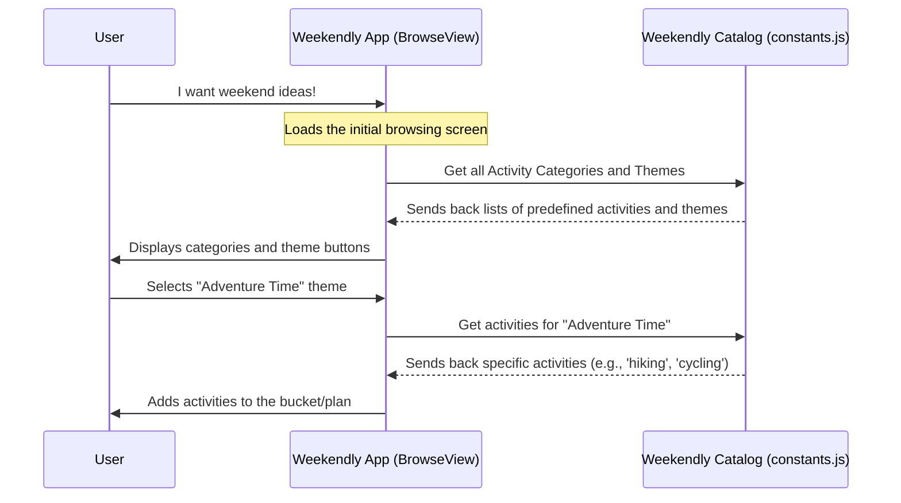
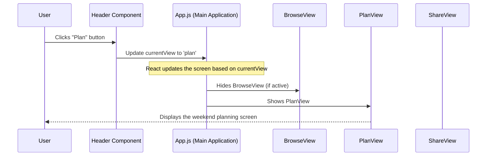
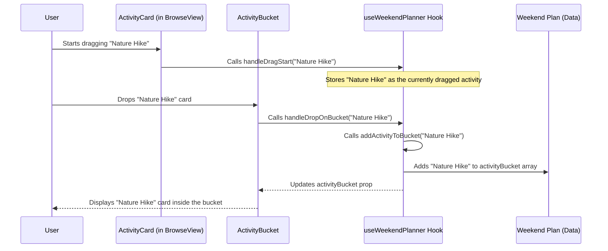
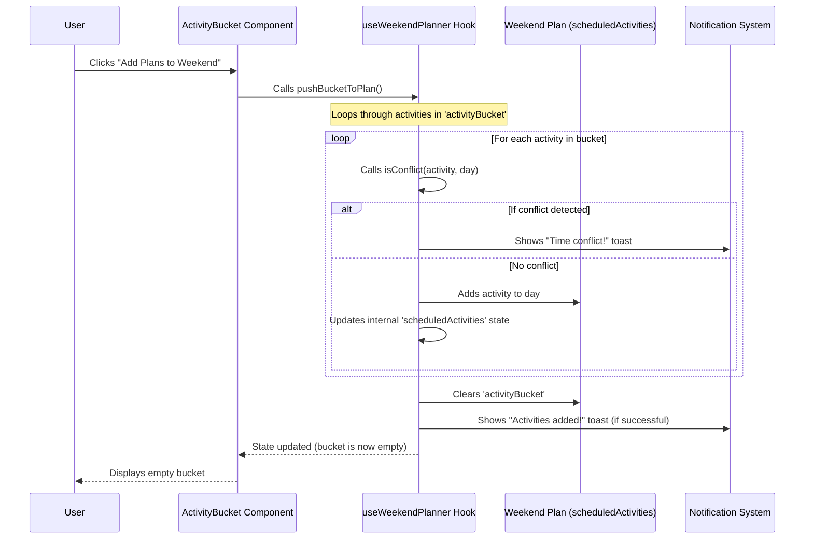
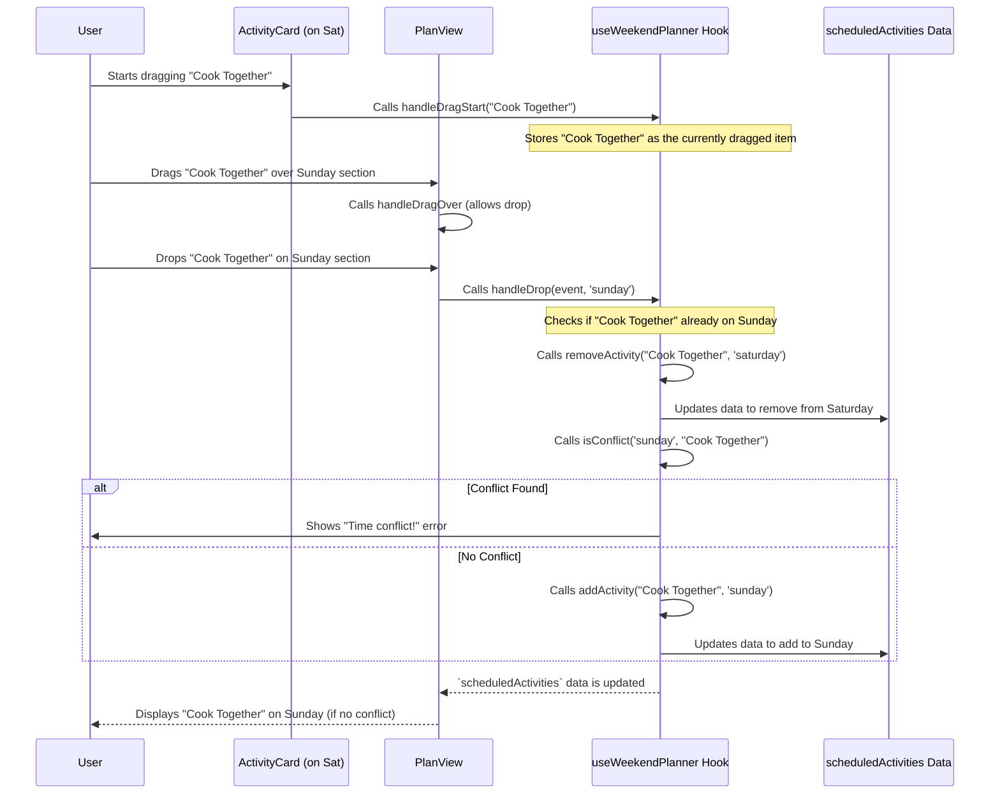
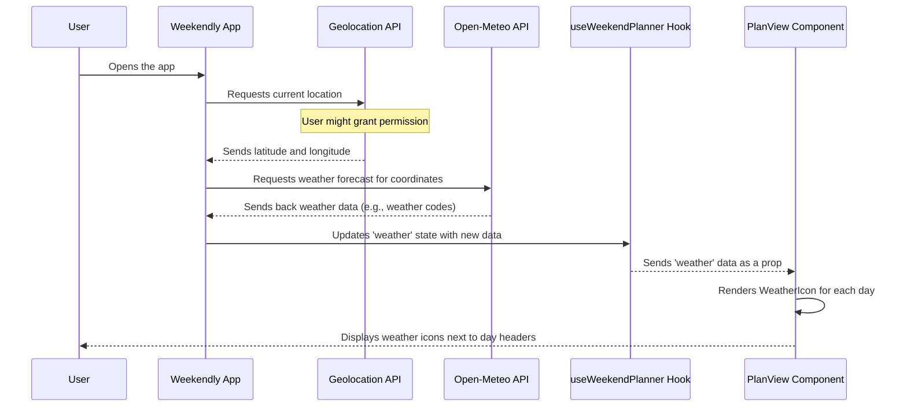
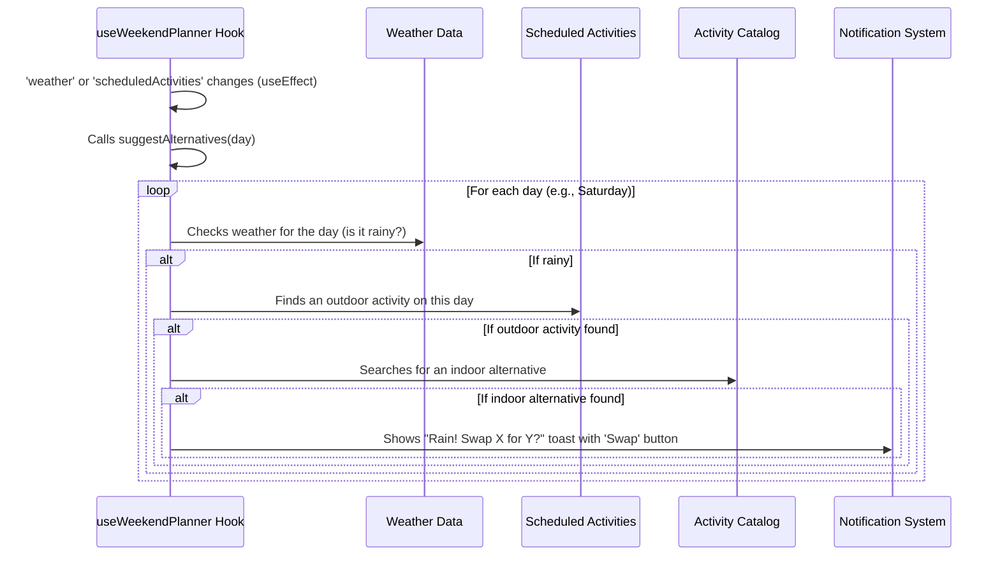
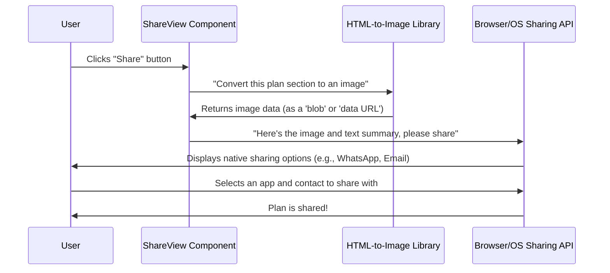

# Chapter 1: Activity & Theme Definitions

Imagine you're trying to plan a super fun weekend, but your mind is completely blank! You don't want to start from scratch, thinking of every single activity. Wouldn't it be great if you had a ready-made menu of exciting ideas, perfectly organized and even grouped into themes?

This is exactly what "Activity & Theme Definitions" is all about in `Weekendly-Atlan`! It's like your personal "master catalog" or a giant recipe book filled with all the possible ingredients and pre-made meal kits for your perfect weekend. This chapter will explain how `Weekendly-Atlan` stores all these awesome ideas, so you can easily pick and choose for your plan.

### What Problem Do We Solve?

The core problem is **overwhelm** and **lack of inspiration** when planning.
`Weekendly-Atlan` solves this by giving you a structured way to browse and select ideas.

**Use Case**: You open the `Weekendly-Atlan` app, feeling like doing something active outdoors, or maybe you just want a "Lazy Weekend." How does the app know what to show you? It looks into its "Activity & Theme Definitions"!

Let's break down how this works.

### The Building Blocks: Activities and Themes

`Weekendly-Atlan` uses two main ideas to give you those brilliant weekend ideas:

1.  **Activities**: These are the individual "things to do." Think of them as single items on a menu.
2.  **Themes**: These are like "combo meals" or "pre-packed kits." They bundle several activities together to create a specific mood or experience.

Let's look at each one more closely.

#### 1. Activities: Your Individual Weekend Ideas

An "Activity" is a single, specific idea for something you can do. Each activity has some important details that describe it.

Here's what an activity might look like:

| Property   | Description                                         | Example                      |
| :--------- | :-------------------------------------------------- | :--------------------------- |
| `id`       | A unique name for the activity (like an ID number). | `hiking`                     |
| `name`     | What the activity is called.                        | `Nature Hike`                |
| `duration` | How long the activity usually takes (in minutes).   | `240` (for 4 hours)          |
| `vibe`     | The general feeling or mood of the activity.        | `energetic`                  |
| `time`     | A suggested start time.                             | `08:00`                      |
| `icon`     | A little picture to represent the activity.         | `Mountain` (a mountain icon) |

These individual activities are then organized into **Activity Categories**. This helps keep everything neat and easy to find. For example, "Nature Hike" would be in the "Outdoor Adventures" category.

Think of it like a library. Each book is an "activity," and all the books about "cooking" are in the "Food & Drinks" section – that's a category!

```javascript
// From src/constants.js
export const activityCategories = {
  food: {
    name: "Food & Drinks",
    icon: "Utensils",
    color: "bg-orange-500",
    activities: [
      {
        id: "brunch",
        name: "Weekend Brunch",
        duration: 90,
        vibe: "relaxed",
        time: "10:00",
        icon: "Coffee",
      },
      {
        id: "cooking",
        name: "Cook Together",
        duration: 120,
        vibe: "energetic",
        time: "18:00",
        icon: "Utensils",
      },
      // ... more food activities
    ],
  },
  outdoor: {
    name: "Outdoor Adventures",
    icon: "Mountain",
    color: "bg-green-500",
    activities: [
      {
        id: "hiking",
        name: "Nature Hike",
        duration: 240,
        vibe: "energetic",
        time: "08:00",
        icon: "Mountain",
      },
      {
        id: "picnic",
        name: "Park Picnic",
        duration: 180,
        vibe: "relaxed",
        time: "12:00",
        icon: "Sun",
      },
      // ... more outdoor activities
    ],
  },
  // ... other categories like entertainment, wellness
};
```

In this code, you can see how `activityCategories` holds different categories like `food` and `outdoor`. Each category has a `name` (like "Food & Drinks"), an `icon`, a `color`, and most importantly, a list of `activities` belonging to that category. Each activity itself is an object with details like `id`, `name`, `duration`, `vibe`, `time`, and `icon`.

#### 2. Themes: Pre-designed Weekend Packages

Sometimes you don't want to pick individual activities; you just know the _kind_ of weekend you want. That's where "Themes" come in handy! A theme is a collection of activities that go well together to create a specific experience.

For example, a "Lazy Weekend" theme might include "reading," "movie marathon," and "brunch."

```javascript
// From src/constants.js
export const themes = {
  lazy: {
    name: "Lazy Weekend",
    color: "bg-blue-500",
    icon: "Bed",
    activities: ["reading", "movie", "brunch", "spa"],
  },
  adventurous: {
    name: "Adventure Time",
    color: "bg-green-500",
    icon: "Rocket",
    activities: ["hiking", "cycling", "food-truck", "concert"],
  },
  // ... other themes like family, romantic, balanced
};
```

Here, `themes` is a list of different themes. Each theme has a `name` (like "Lazy Weekend"), a `color`, an `icon`, and a list of `activities`. Notice that the `activities` list here only uses the `id` (e.g., `'reading'`) for each activity. `Weekendly-Atlan` then looks up these `id`s in the `activityCategories` to get the full details for each activity.

### How Weekendly-Atlan Uses These Definitions

When you open `Weekendly-Atlan`, the first thing you see is often a screen where you can browse ideas. This is where our "Activity & Theme Definitions" shine!

**Example Scenario**: You want to plan an "Adventure Time" weekend.

1.  **You see the "Adventure Time" theme**: The app presents this theme along with others.
2.  **You click on it**: You're telling the app, "I want this package!"
3.  **The app looks up the theme**: It finds the "Adventure Time" theme in its definitions (`themes`).
4.  **It finds the activities for that theme**: It sees the `activities` list (e.g., `['hiking', 'cycling', 'food-truck', 'concert']`).
5.  **It adds these activities to your plan**: Now, your weekend plan is instantly populated with "Nature Hike," "City Cycling," "Food Truck Hunt," and "Live Music"!

This makes planning super fast because you don't have to pick each one individually. Of course, you can still mix and match later by adding individual activities from different categories.

### Under the Hood: Where Do These Definitions Live?

Let's peek behind the curtain to see how `Weekendly-Atlan` manages these definitions.

When you open the app, it needs to load all the possible activities and themes. Think of it like a chef checking their pantry for all available ingredients and pre-made sauces.



The `Weekendly App (BrowseView)` is the part of the application you see and interact with. The `Weekendly Catalog (constants.js)` is where all our activities and themes are neatly defined and stored.

Let's look at the actual code in the `src/constants.js` file, which acts as our "Weekendly Catalog." This file contains simple JavaScript objects that hold all our definitions.

```javascript
// src/constants.js (Simplified)
export const activityCategories = {
  food: {
    /* ... details for Food & Drinks ... */
  },
  outdoor: {
    name: "Outdoor Adventures",
    activities: [
      { id: "hiking", name: "Nature Hike", duration: 240 /* ... */ },
      { id: "picnic", name: "Park Picnic", duration: 180 /* ... */ },
    ],
  },
};

export const themes = {
  lazy: {
    name: "Lazy Weekend",
    activities: ["reading", "movie", "brunch", "spa"],
  },
  adventurous: {
    name: "Adventure Time",
    activities: ["hiking", "cycling", "food-truck", "concert"],
  },
};
```

As you can see, `constants.js` is just a JavaScript file that exports (makes available to other parts of the app) these `activityCategories` and `themes` objects. These objects are essentially big dictionaries or maps, where each key (like `food` or `lazy`) points to the details of a category or a theme.

Now, let's see how the `BrowseView` component (which is the screen you interact with) uses these definitions from `constants.js` to show you options.

```javascript
// src/components/views/BrowseView.js (Simplified)
import React from "react";
import * as Icons from "lucide-react"; // For nice little icons
import { themes, activityCategories } from "../../constants"; // Import our definitions!

const BrowseView = ({ applyTheme, addActivityToBucket }) => {
  return (
    <div>
      {/* Display Themes */}
      <div className="grid grid-cols-2 gap-4 mb-8">
        {Object.entries(themes).map(([key, theme]) => {
          const IconComponent = Icons[theme.icon]; // Get the right icon
          return (
            <button key={key} onClick={() => applyTheme(key)}>
              <IconComponent className="w-8 h-8" />
              <div className="font-semibold text-sm">{theme.name}</div>
            </button>
          );
        })}
      </div>

      {/* Display Activity Categories */}
      <div className="space-y-6">
        {Object.entries(activityCategories).map(([categoryKey, category]) => {
          const IconComponent = Icons[category.icon];
          return (
            <div key={categoryKey}>
              <h3 className="text-lg font-semibold">{category.name}</h3>
              <div className="grid grid-cols-1 gap-4">
                {category.activities.map((activity) => (
                  <div key={activity.id}>
                    {activity.name} {/* Display activity name */}
                    <button onClick={() => addActivityToBucket(activity)}>
                      +
                    </button>
                  </div>
                ))}
              </div>
            </div>
          );
        })}
      </div>
    </div>
  );
};

export default BrowseView;
```

In `BrowseView.js`:

- We first `import` our `themes` and `activityCategories` from `../../constants`. This brings all our defined ideas into this part of the app.
- The code then uses `Object.entries(themes).map(...)` to go through each theme. For every theme, it creates a `button` with its icon and name. When you click it, the `applyTheme` function is called to add that theme's activities to your plan.
- Similarly, it loops through `activityCategories` and then each `activity` within those categories, displaying them with their names and a "+" button to add them individually to your plan (called `activityBucket` here).

This shows how our simple, organized definitions in `constants.js` become the interactive elements you see on screen, allowing you to easily browse and select your weekend ideas.

### Conclusion

In this first chapter, we've explored the foundational "Activity & Theme Definitions" in `Weekendly-Atlan`. We learned that individual **activities** are the basic building blocks, each with its own details like duration and vibe. These activities are organized into **categories**. We also discovered **themes**, which are pre-configured packages of activities designed to create a specific weekend experience. These definitions are stored in `src/constants.js` and are loaded by the `BrowseView` component to present you with a wide array of options for your weekend.

Understanding these definitions is crucial because they are the raw materials for everything you'll do in `Weekendly-Atlan`.

Now that we know _what_ ideas `Weekendly-Atlan` has, let's move on to _how_ these ideas are displayed to you. In the next chapter, we'll dive into [Application Views](02_application_views_.md), which covers how the app visually presents these activities and themes, allowing you to interact with them.

---

<sub><sup>Generated by [AI Codebase Knowledge Builder](https://github.com/The-Pocket/Tutorial-Codebase-Knowledge).</sup></sub> <sub><sup>**References**: [[1]](https://github.com/HiRoaR2002/Weekendly-Atlan/blob/8e8995da80d9ed65518f7865f3acfc5ae3784263/src/components/views/BrowseView.js), [[2]](https://github.com/HiRoaR2002/Weekendly-Atlan/blob/8e8995da80d9ed65518f7865f3acfc5ae3784263/src/constants.js), [[3]](https://github.com/HiRoaR2002/Weekendly-Atlan/blob/8e8995da80d9ed65518f7865f3acfc5ae3784263/src/hooks/useWeekendPlanner.js)</sup></sub>

# Chapter 2: Application Views

Welcome back! In [Chapter 1: Activity & Theme Definitions](01_activity___theme_definitions_.md), we learned all about the exciting activities and pre-made themes `Weekendly-Atlan` has stored for your perfect weekend. Think of those definitions as a giant cookbook filled with delicious recipes.

Now, imagine you have this amazing cookbook, but it's just a stack of loose pages! How would you find a recipe? How would you prepare it? And how would you show off your culinary masterpiece? You'd need different areas in your kitchen for each task, right?

This is exactly what "Application Views" are in `Weekendly-Atlan`! They are the distinct "rooms" or "pages" of our app, each designed for a specific part of your weekend planning journey. Instead of a jumbled mess, views help organize all those activities and themes into clear, easy-to-use sections.

### What Problem Do We Solve?

The core problem is **organization** and **user experience**.
`Weekendly-Atlan` solves this by breaking down the planning process into logical steps, each with its own dedicated screen.

**Use Case**: You've opened `Weekendly-Atlan`. You want to first find ideas, then arrange them into a schedule, and finally, share your plan with friends. How does the app guide you through these distinct stages? It uses Application Views!

Let's explore these different "rooms" of the `Weekendly-Atlan` house.

### The Three Main Views (and the Navigator!)

`Weekendly-Atlan` has three main views, each with a clear purpose:

1.  **BrowseView**: Your "Discovery Room"
2.  **PlanView**: Your "Planning Table"
3.  **ShareView**: Your "Showcase Gallery"

And to move between these rooms, we have a special guide: The **Header** component.

Let's look at each one.

#### 1. BrowseView: Find Your Perfect Ideas

This is the first room you usually enter. Remember all those [Activity & Theme Definitions](01_activity___theme_definitions_.md) from Chapter 1? The `BrowseView` is where they come to life! It's like flipping through our cookbook, seeing all the delicious options.

- **Purpose**: Discover, browse, and select individual activities or entire themes to kickstart your plan.
- **What you see**: A list of themes (like "Lazy Weekend" or "Adventure Time") and categories of activities (like "Outdoor Adventures" or "Food & Drinks").
- **What you do**: Click a theme to add its activities to your plan, or click a plus button next to an individual activity to add it.

#### 2. PlanView: Organize Your Weekend

Once you've picked some ideas, you'll move to the `PlanView`. This is where you actually arrange your weekend. It's like having all your ingredients on a big kitchen island and deciding what to cook when.

- **Purpose**: Arrange, fine-tune, and visualize your scheduled activities for Saturday and Sunday.
- **What you see**: Your weekend laid out day by day, with spaces for activities.
- **What you do**: Drag activities to different days, reorder them, adjust their times, and remove them if needed. This view helps you build your perfect schedule.

#### 3. ShareView: Show Off Your Plan

After all that hard work planning, you'll want to share your masterpiece! The `ShareView` is the perfect place to do that. It's like putting your finished meal on a beautifully set table for everyone to admire.

- **Purpose**: Present your completed weekend plan in a nice format and share it with friends or family.
- **What you see**: A summary of your weekend, often with a theme and a list of scheduled activities.
- **What you do**: Download your plan as an image or share it directly through other apps.

#### The Header: Your Navigation Control Panel

The `Header` component isn't a view itself, but it's super important because it helps you switch between the views. Think of it as the main hallway of our `Weekendly-Atlan` house, with doors to each room.

- **Purpose**: Provides easy navigation to jump between `BrowseView`, `PlanView`, and `ShareView`.
- **What you see**: Buttons at the top of the screen labeled "Browse," "Plan," and "Share."
- **What you do**: Click a button to instantly go to that specific view.

### How to Use: Changing Views

Let's go back to our use case: You want to browse, then plan, then share.

1.  **Start in Browse**: When you open `Weekendly-Atlan`, you'll usually land in the `BrowseView` by default. This is your starting point for discovering ideas.
2.  **Move to Plan**: After selecting activities, you'll click the "Plan" button in the `Header`. This will take you to the `PlanView` where you can arrange your schedule.
3.  **Go to Share**: Once your plan is perfect, click the "Share" button in the `Header` to enter the `ShareView` and present your weekend.

It's just like walking from your discovery room to your planning table, then to your showcase gallery!

### Under the Hood: How Views are Managed

How does the app know which "room" to show you? It's like a central command center that decides which part of the house is currently "active."

#### Step-by-Step Flow

When you click a button in the `Header`:

1.  **You click a button**: For example, you click "Plan" in the `Header`.
2.  **Header tells the App**: The `Header` component sends a message to the main `Weekendly-Atlan` application (which lives in `App.js`), saying, "The user wants to see the 'plan' view!"
3.  **App decides**: The main `App.js` component has a special variable (called `currentView`) that keeps track of which view should be shown. When it gets the message from the `Header`, it updates this variable to `'plan'`.
4.  **App displays the correct view**: Based on the `currentView` variable, the `App.js` then hides the `BrowseView` and shows the `PlanView` on your screen.

Here's a simplified diagram of this process:



#### Code Walkthrough: The `App.js` and `Header.js` Connection

Let's look at the actual code that makes this happen.

First, in `src/App.js`, which is the main brain of our application:

```javascript
// src/App.js (Simplified)
import React from "react";
import Header from "./components/layout/Header";
import BrowseView from "./components/views/BrowseView";
import PlanView from "./components/views/PlanView";
import ShareView from "./components/views/ShareView";
import useWeekendPlanner from "./hooks/useWeekendPlanner"; // Manages app logic

const App = () => {
  const {
    currentView, // This variable tells us which view is active
    setCurrentView, // This function changes which view is active
    // ... other parts of our app logic
  } = useWeekendPlanner(); // Our custom logic hook

  return (
    <div>
      {/* The Header component is always visible */}
      <Header currentView={currentView} setCurrentView={setCurrentView} />

      <main>
        {/* We only show one view at a time based on currentView */}
        {currentView === "browse" && <BrowseView /* ...props... */ />}
        {currentView === "plan" && <PlanView /* ...props... */ />}
        {currentView === "share" && <ShareView /* ...props... */ />}
      </main>
    </div>
  );
};

export default App;
```

In this code:

- `App.js` gets `currentView` (e.g., `'browse'`, `'plan'`, `'share'`) and `setCurrentView` from `useWeekendPlanner`. These are like our current room and the way to change rooms.
- The `Header` component is always displayed. It receives `currentView` (so it can highlight the active tab) and `setCurrentView` (so it can change the view when you click a button).
- Inside `<main>`, we use a special trick: `currentView === 'browse' && (<BrowseView />)`. This means "IF `currentView` is 'browse', THEN show the `BrowseView` component." Only one of these conditions will be true at a time, so only one view is ever visible.

Now, let's see how the `Header` component (`src/components/layout/Header.js`) works:

```javascript
// src/components/layout/Header.js (Simplified)
import React from 'react';
import { Calendar, Share2 } from 'lucide-react';

const Search = ({ className }) => ( /* Simplified Search Icon */ );

const Header = ({ currentView, setCurrentView }) => {
  return (
    <header>
      <nav>
        {[
          { key: 'browse', label: 'Browse', icon: Search },
          { key: 'plan', label: 'Plan', icon: Calendar },
          { key: 'share', label: 'Share', icon: Share2 }
        ].map(({ key, label, icon: Icon }) => (
          <button
            key={key}
            onClick={() => setCurrentView(key)} // IMPORTANT: This changes the view!
            className={currentView === key ? 'active-style' : 'inactive-style'}
          >
            <Icon className="w-4 h-4" />
            <span>{label}</span>
          </button>
        ))}
      </nav>
    </header>
  );
};

export default Header;
```

In the `Header.js` code:

- It receives `currentView` (to know which button to make "active") and `setCurrentView` (the function to change the view).
- It creates a button for each view (`browse`, `plan`, `share`).
- When a button is clicked, `onClick={() => setCurrentView(key)}` is called. For example, if you click "Plan", `setCurrentView('plan')` is executed. This updates the `currentView` variable in `App.js`, which then causes the `PlanView` to be displayed.

Each of the view components (`BrowseView`, `PlanView`, `ShareView`) is responsible for its own specific layout and features, using the activities and themes we discussed in [Chapter 1: Activity & Theme Definitions](01_activity___theme_definitions_.md), as well as other app logic.

### Conclusion

In this chapter, we've explored the concept of "Application Views" in `Weekendly-Atlan`. We learned that the app is divided into three main "rooms" or "pages": the `BrowseView` for discovering ideas, the `PlanView` for organizing your schedule, and the `ShareView` for presenting your finished plan. The `Header` component acts as our navigator, allowing us to easily move between these views.

Understanding application views is key to navigating and using `Weekendly-Atlan` effectively. It helps us keep track of where we are in the planning process and what we can do in each section.

Now that we know _where_ we are in the app, let's dive into _what_ we can do with the individual activities. In the next chapter, we'll explore [Interactive Activity Components](03_interactive_activity_components_.md) and learn how you can interact with each activity item to build your perfect weekend!

---

<sub><sup>Generated by [AI Codebase Knowledge Builder](https://github.com/The-Pocket/Tutorial-Codebase-Knowledge).</sup></sub> <sub><sup>**References**: [[1]](https://github.com/HiRoaR2002/Weekendly-Atlan/blob/8e8995da80d9ed65518f7865f3acfc5ae3784263/src/App.js), [[2]](https://github.com/HiRoaR2002/Weekendly-Atlan/blob/8e8995da80d9ed65518f7865f3acfc5ae3784263/src/components/layout/Header.js), [[3]](https://github.com/HiRoaR2002/Weekendly-Atlan/blob/8e8995da80d9ed65518f7865f3acfc5ae3784263/src/components/ui/FloatingActionButton.js), [[4]](https://github.com/HiRoaR2002/Weekendly-Atlan/blob/8e8995da80d9ed65518f7865f3acfc5ae3784263/src/components/views/BrowseView.js), [[5]](https://github.com/HiRoaR2002/Weekendly-Atlan/blob/8e8995da80d9ed65518f7865f3acfc5ae3784263/src/components/views/PlanView.js), [[6]](https://github.com/HiRoaR2002/Weekendly-Atlan/blob/8e8995da80d9ed65518f7865f3acfc5ae3784263/src/components/views/ShareView.js)</sup></sub>

# Chapter 3: Interactive Activity Components

Welcome back, future weekend planner! In [Chapter 1: Activity & Theme Definitions](01_activity___theme_definitions_.md), we stocked our virtual pantry with all sorts of delicious weekend ideas. Then, in [Chapter 2: Application Views](02_application_views_.md), we learned about the different "rooms" in our app (like `BrowseView` and `PlanView`) where we discover and organize those ideas.

Now, imagine you're looking at a menu in a restaurant. It's great to see all the dishes, but how do you actually _order_ one? How do you tell the chef you want that specific meal, or maybe switch it out for another?

This is where "Interactive Activity Components" come in! These are the hands-on tools you use to grab, move, and tweak the activities you've chosen. They're the buttons, the drag-and-drop features, and the little forms that let you truly _interact_ with your weekend ideas.

### What Problem Do We Solve?

The core problem is **making activities tangible and movable**.
`Weekendly-Atlan` solves this by giving you visual, interactive representations of your activities that you can easily manipulate.

**Use Case**: You're looking at a bunch of activities in the `BrowseView`. You see "Nature Hike" and "Park Picnic." You want to quickly gather them up, maybe adjust their times, and then put them into your plan. How does the app let you do this so easily? It uses `ActivityCard` and `ActivityBucket`!

Let's dive into these interactive building blocks.

### The Dynamic Duo: ActivityCard and ActivityBucket

`Weekendly-Atlan` uses two main components to make your activities interactive:

1.  **ActivityCard**: Your "Mini Activity Poster"
2.  **ActivityBucket**: Your "Temporary Shopping Cart"

Let's explore each one.

#### 1. ActivityCard: Your Mini Activity Poster

Think of an `ActivityCard` as a small, easy-to-handle poster for each individual activity. It shows you the key details at a glance, and it's designed to be picked up, moved around, or changed.

- **What it shows**:

  - **Name**: What the activity is (e.g., "Nature Hike").
  - **Duration**: How long it takes (e.g., "240 min").
  - **Vibe**: The mood (e.g., "energetic").
  - **Icon**: A little picture representing it (e.g., a mountain).
  - **Time**: (Optionally) a suggested start time, which you can change!

- **How you interact with it**:
  - **Drag-and-Drop**: You can literally pick it up with your mouse (or finger) and drag it to a new spot.
  - **Remove**: There's usually a little "X" button to take it out of your plan or bucket.
  - **Change Time**: If it's in your plan, you can adjust its start time using a small input field.

Here's a simplified look at what an `ActivityCard` displays:

| Feature       | Description                              | Example on Card                                                                                                                      |
| :------------ | :--------------------------------------- | :----------------------------------------------------------------------------------------------------------------------------------- |
| Activity Name | "Nature Hike"                            | **Nature Hike**                                                                                                                      |
| Duration      | "240 min"                                | 240 min                                                                                                                              |
| Vibe          | "energetic"                              | <span style="background-color: #f97316; color: white; padding: 2px 8px; border-radius: 9999px; font-size: 0.75rem;">energetic</span> |
| Icon          | (Mountain icon)                          | ⛰️                                                                                                                                   |
| Time Input    | (Only in `PlanView` or `ActivityBucket`) | <input type="time" value="08:00"/>                                                                                                   |
| Remove Button | (X icon)                                 | ✖️                                                                                                                                   |

<br/>

#### 2. ActivityBucket: Your Temporary Shopping Cart

The `ActivityBucket` is like a temporary holding area for activities you're interested in but haven't committed to your final weekend plan yet. Imagine you're browsing in a store; you put things in your cart before you decide to buy them.

- **Purpose**: Gather activities you like from the `BrowseView` before placing them into your actual schedule in the `PlanView`.
- **What you see**: A clear box that shows all the `ActivityCard`s you've dragged or added into it.
- **What you do**:
  - **Drop Activities**: Drag `ActivityCard`s from the `BrowseView` and drop them here.
  - **Review/Edit**: See all your chosen activities and adjust their times.
  - **Remove Activities**: Take activities out of the bucket if you change your mind.
  - **Push to Plan**: A special button to move all activities from the bucket into your [PlanView](02_application_views_.md).

### How to Use: Building Your Weekend with Interactive Components

Let's walk through our use case: You want to gather "Nature Hike" and "Park Picnic," adjust their times, and then add them to your plan.

1.  **Browse and Select**: You start in the `BrowseView`.

    - You see "Nature Hike" and "Park Picnic" as `ActivityCard`s.
    - You can either click the little `+` button next to each activity, or directly drag them.

2.  **Gather in the `ActivityBucket`**:

    - If you click `+`, the `ActivityCard` for "Nature Hike" automatically appears in the `ActivityBucket`.
    - If you drag, you literally drag the "Nature Hike" `ActivityCard` and drop it into the `ActivityBucket` area. Do the same for "Park Picnic."

3.  **Adjust Times (Optional) in the `ActivityBucket`**:

    - Inside the `ActivityBucket`, each `ActivityCard` now has a small time input. You can change "Nature Hike" to `08:00` and "Park Picnic" to `12:00`.

4.  **Commit to Plan**:

    - Once you're happy with your selection in the bucket, you click the "Add Plans" button associated with the `ActivityBucket`.
    - All activities from your `ActivityBucket` are now moved into your actual weekend schedule in the `PlanView`. The `ActivityBucket` then empties itself, ready for your next round of selections!

5.  **Further Refine in `PlanView`**:
    - Now in the `PlanView`, you see your `ActivityCard`s for "Nature Hike" and "Park Picnic" placed on your chosen days.
    - You can drag them between Saturday and Sunday, or even reorder them within a day.
    - You can fine-tune their times again, or click the `X` to remove them from your final plan if you change your mind.

This intuitive drag-and-drop and click-to-add system makes planning dynamic and fun!

### Under the Hood: How Interaction Works

So, how does `Weekendly-Atlan` know what to do when you drag a card or click a button? It's all thanks to clever programming that connects the visual components to the core logic of the app.

#### The Brain: `useWeekendPlanner` Hook

Remember our `useWeekendPlanner` from [Chapter 2: Application Views](02_application_views_.md)? This is where most of the "thinking" happens. It manages the list of activities in your bucket and in your schedule, and it provides special functions for `ActivityCard` and `ActivityBucket` to call when you interact with them.

#### Step-by-Step: Dragging from Browse to Bucket

Let's trace what happens when you drag an `ActivityCard` from the `BrowseView` into the `ActivityBucket`.



This diagram shows that when you interact with an `ActivityCard` or `ActivityBucket`, they don't do all the work themselves. Instead, they tell the central `useWeekendPlanner` hook what happened (e.g., "I was dragged," "something was dropped on me"). The hook then updates the main lists of activities, and the `ActivityCard`s and `ActivityBucket` simply update their display based on those changes.

#### Code Walkthrough: Connecting Components and Logic

Let's look at simplified code snippets to see how `ActivityCard` and `ActivityBucket` are built and how they communicate with `useWeekendPlanner`.

##### `ActivityCard.js`: The Interactive Mini-Poster

This component receives the activity's details and functions to call when you interact.

```javascript
// src/components/ui/ActivityCard.js (Simplified)
import React from "react";
import { X } from "lucide-react"; // For the remove button

const ActivityCard = ({
  activity,
  isDraggable,
  onDragStart,
  onRemove,
  onTimeChange,
  showTime = true,
}) => {
  return (
    <div
      draggable={isDraggable} // Makes the card draggable if true
      onDragStart={(e) => onDragStart(e, activity)} // What to do when dragging starts
    >
      <h3>{activity.name}</h3>
      <p>{activity.duration} min</p>
      {onRemove && ( // Show remove button if onRemove function is provided
        <button onClick={() => onRemove(activity.id)}>
          <X className="w-4 h-4" />
        </button>
      )}
      {showTime &&
        onTimeChange && ( // Show time input if showTime and onTimeChange are provided
          <input
            type="time"
            value={activity.time || "12:00"}
            onChange={(e) => onTimeChange(activity.id, null, e.target.value)}
          />
        )}
    </div>
  );
};

export default ActivityCard;
```

- `draggable={isDraggable}`: This is a standard HTML attribute that makes an element draggable. `isDraggable` comes from the parent component (like `BrowseView`).
- `onDragStart`: When you begin dragging, this calls the `onDragStart` function (provided by `useWeekendPlanner` via a parent view) and tells it _which_ activity is being dragged.
- `onRemove` and `onTimeChange`: These functions (also passed from `useWeekendPlanner` through parent views) are called when you click the 'X' or change the time in the input. They tell the main app logic to update the activity.

##### `ActivityBucket.js`: The Temporary Collector

This component defines the area where `ActivityCard`s can be dropped and displays them.

```javascript
// src/components/ui/ActivityBucket.js (Simplified)
import React from "react";
import ActivityCard from "./ActivityCard";

const ActivityBucket = ({
  bucket,
  onDrop,
  onDragOver,
  onRemove,
  onTimeChange,
}) => {
  return (
    <div
      onDrop={onDrop} // What to do when an activity is dropped here
      onDragOver={onDragOver} // Allows dropping here
    >
      <h3>Your Activity Bucket</h3>
      {bucket.length === 0 ? (
        <p>Drag and drop activities here</p>
      ) : (
        <div className="bucket-grid">
          {bucket.map((activity) => (
            <ActivityCard
              key={activity.id}
              activity={activity}
              isDraggable={false} // Activities in bucket aren't typically dragged *from* it back to browse
              onRemove={onRemove}
              showTime={true}
              onTimeChange={(activityId, _, newTime) =>
                onTimeChange(activityId, newTime)
              }
            />
          ))}
        </div>
      )}
    </div>
  );
};

export default ActivityBucket;
```

- `onDrop` and `onDragOver`: These are HTML drag-and-drop event handlers. `onDrop` is crucial; it's called when an activity is released over the bucket. `onDragOver` simply tells the browser that this element _can_ accept a drop. Both call functions provided by `useWeekendPlanner`.
- `bucket.map(activity => <ActivityCard ... />)`: The `ActivityBucket` iterates through its `bucket` (a list of activities) and displays an `ActivityCard` for each one, passing its own `onRemove` and `onTimeChange` functions down.

##### Connecting in `BrowseView.js`

The `BrowseView` is where these components first come together.

```javascript
// src/components/views/BrowseView.js (Simplified)
import React from "react";
import ActivityCard from "../ui/ActivityCard";
import ActivityBucket from "../ui/ActivityBucket";

const BrowseView = ({
  activityCategories,
  addActivityToBucket,
  activityBucket,
  handleDropOnBucket,
  handleDragOver,
  handleDragStart,
  handleDragEnd,
  removeActivityFromBucket,
  pushBucketToPlan,
  updateActivityBucketTime,
}) => {
  return (
    <div>
      <ActivityBucket
        bucket={activityBucket}
        onDrop={handleDropOnBucket}
        onDragOver={handleDragOver}
        onRemove={removeActivityFromBucket}
        onTimeChange={updateActivityBucketTime}
      />
      <button onClick={pushBucketToPlan}>Add Plans to Weekend</button>

      {/* Displaying activities from categories */}
      {Object.entries(activityCategories).map(([categoryKey, category]) => (
        <div key={categoryKey}>
          <h3>{category.name}</h3>
          {category.activities.map((activity) => (
            <div key={activity.id}>
              <ActivityCard
                activity={activity}
                isDraggable={true} // Activities from browse are draggable
                onDragStart={handleDragStart}
                onDragEnd={handleDragEnd}
                showTime={false} // No time input on initial browse cards
              />
              <button onClick={() => addActivityToBucket(activity)}>+</button>
            </div>
          ))}
        </div>
      ))}
    </div>
  );
};

export default BrowseView;
```

- You can see how `BrowseView` renders `ActivityBucket` and passes it all the necessary functions (`handleDropOnBucket`, `removeActivityFromBucket`, etc.) directly from `useWeekendPlanner`.
- It also renders many `ActivityCard`s for browsing. Each one gets `isDraggable={true}` and the `handleDragStart` function so you can pick them up. The `+` button directly calls `addActivityToBucket`.

This setup ensures that all interactions with `ActivityCard`s and the `ActivityBucket` ultimately trigger the right logic within `useWeekendPlanner`, keeping your weekend plan consistent and up-to-date.

### Conclusion

In this chapter, we've explored the "Interactive Activity Components" that make `Weekendly-Atlan` a joy to use. We learned about the `ActivityCard` as our individual "mini-poster" for each activity, allowing us to see details, drag it, remove it, and adjust its time. We also discovered the `ActivityBucket`, acting as a temporary "shopping cart" to gather activities before adding them to our final plan. These components, powered by the central `useWeekendPlanner` hook, enable seamless drag-and-drop and intuitive interaction.

Understanding how these components work together gives you a complete picture of how to gather and organize your weekend ideas. Now that we know _what_ these interactive pieces are and _how_ to use them, let's dive deeper into the core brain that makes all these interactions meaningful. In the next chapter, we'll explore the [Weekend Planner Core Logic](04_weekend_planner_core_logic_.md), which handles things like managing the schedule, checking for conflicts, and more!

---

<sub><sup>Generated by [AI Codebase Knowledge Builder](https://github.com/The-Pocket/Tutorial-Codebase-Knowledge).</sup></sub> <sub><sup>**References**: [[1]](https://github.com/HiRoaR2002/Weekendly-Atlan/blob/8e8995da80d9ed65518f7865f3acfc5ae3784263/src/components/ui/ActivityBucket.js), [[2]](https://github.com/HiRoaR2002/Weekendly-Atlan/blob/8e8995da80d9ed65518f7865f3acfc5ae3784263/src/components/ui/ActivityCard.js), [[3]](https://github.com/HiRoaR2002/Weekendly-Atlan/blob/8e8995da80d9ed65518f7865f3acfc5ae3784263/src/components/views/BrowseView.js), [[4]](https://github.com/HiRoaR2002/Weekendly-Atlan/blob/8e8995da80d9ed65518f7865f3acfc5ae3784263/src/components/views/PlanView.js), [[5]](https://github.com/HiRoaR2002/Weekendly-Atlan/blob/8e8995da80d9ed65518f7865f3acfc5ae3784263/src/hooks/useWeekendPlanner.js)</sup></sub>

# Chapter 4: Weekend Planner Core Logic

Welcome back, master planner! In [Chapter 1: Activity & Theme Definitions](01_activity___theme_definitions_.md), we learned about all the cool activities and themes available. In [Chapter 2: Application Views](02_application_views_.md), we explored the different screens of the app (Browse, Plan, Share). And in [Chapter 3: Interactive Activity Components](03_interactive_activity_components_.md), we saw how you can pick up, drag, and drop individual activities.

Now, imagine you're planning a big party. You have a guest list (activities), a venue (the app views), and helpers to set up decorations (interactive components). But who's the **party organizer**? Who keeps track of who's coming, what time things start, makes sure the cake arrives on time, and prevents two different shows from being scheduled at the exact same moment?

That's exactly what the "Weekend Planner Core Logic" is in `Weekendly-Atlan`! It's the central brain, the project manager, the ultimate organizer that makes sure your weekend plan is smart, consistent, and perfectly managed. It's the silent hero working behind the scenes, making all your interactions meaningful.

### What Problem Do We Solve?

The core problem is **managing complexity and ensuring consistency** across your entire weekend plan.
`Weekendly-Atlan` solves this by having one central place that understands all the rules, tracks all the data, and orchestrates every change you make.

**Use Case**: You've selected "Nature Hike" for Saturday morning and "City Cycling" for Saturday afternoon. You then drag "Park Picnic" to Saturday, but it tries to start at the exact same time as your "Nature Hike"! How does the app know this is a problem and prevent it? The Weekend Planner Core Logic handles this!

Let's explore this central brain of `Weekendly-Atlan`.

### The Master Organizer: `useWeekendPlanner`

In `Weekendly-Atlan`, the entire "Weekend Planner Core Logic" lives inside a special JavaScript tool called `useWeekendPlanner`. Think of `useWeekendPlanner` as the app's personal assistant, responsible for everything important:

1.  **Remembering Everything (State Management)**: It keeps track of all the crucial information about your weekend.

    - What activities are in your "bucket"?
    - Which activities are officially "scheduled" for Saturday and Sunday?
    - What theme did you choose?
    - Even what the weather forecast is!

2.  **Applying the Rules (Business Logic)**: It knows all the intelligent rules for planning.

    - **Time Conflict Detection**: "Oops! You can't do two things at once."
    - **Theme Application**: "You picked 'Adventure Time'? Great, here are all the activities that go with it, placed nicely in your bucket or schedule."
    - **Activity Management**: "Add this activity," "Remove that activity," "Update its time."

3.  **Coordinating Actions (Central Control)**: Every time you interact with the app (e.g., click a button, drag an activity), the interactive components ([Chapter 3: Interactive Activity Components](03_interactive_activity_components_.md)) don't do the heavy lifting themselves. Instead, they send a message to `useWeekendPlanner`, saying, "Hey, this happened! What should we do?" The `useWeekendPlanner` then performs the necessary changes and updates.

### How to Use: Letting the Core Logic Work for You

As a user, you don't directly "use" the `useWeekendPlanner` hook. Instead, you interact with the app's buttons, cards, and views. These visual elements then tell the `useWeekendPlanner` hook what to do.

Let's revisit our use case: You want to plan activities for Saturday and avoid conflicts.

1.  **You Add Activities (e.g., from Browse View):**

    - You click the `+` button next to "Nature Hike" and "Park Picnic" in the [BrowseView](02_application_views_.md).
    - The `BrowseView` calls a function from `useWeekendPlanner` (like `addActivityToBucket`).
    - **Core Logic Action**: `useWeekendPlanner` adds these activities to its internal `activityBucket` list.

2.  **You Push to Plan (from Activity Bucket):**

    - You click the "Add Plans to Weekend" button on the `ActivityBucket`.
    - The `ActivityBucket` calls `pushBucketToPlan` from `useWeekendPlanner`.
    - **Core Logic Action**:
      - `useWeekendPlanner` takes each activity from the bucket.
      - For each one, it checks if it conflicts with anything _already_ in the plan (using its `isConflict` rule).
      - If there's no conflict, it adds the activity to the `scheduledActivities` list for a specific day.
      - If there _is_ a conflict, it will show an error message and _not_ add the activity to that time slot.

3.  **You Adjust Times (in Plan View):**
    - You're in the [PlanView](02_application_views_.md) and change "Nature Hike" from 08:00 to 09:00.
    - The `ActivityCard` for "Nature Hike" calls `updateActivityTime` from `useWeekendPlanner`.
    - **Core Logic Action**:
      - `useWeekendPlanner` first checks if the _new_ time (09:00) causes a conflict with other scheduled activities (again, using `isConflict`).
      - If there's a conflict, it will show an error and keep the old time.
      - If no conflict, it updates the time for "Nature Hike" in its `scheduledActivities` list.

This central logic ensures that no matter how you interact with the app, your plan remains organized and free of overlapping activities.

### Under the Hood: The `useWeekendPlanner` Hook in Action

Let's peek behind the curtain at `src/hooks/useWeekendPlanner.js` to see how this master organizer works.

#### Step-by-Step: Adding Activities from the Bucket to the Plan

Imagine you have two activities in your `ActivityBucket` and you click "Add Plans to Weekend."



This diagram shows how `pushBucketToPlan` (a function inside `useWeekendPlanner`) takes charge. It carefully goes through each item, checks for problems, updates the main plan, and keeps you informed.

#### Code Walkthrough: Inside `useWeekendPlanner.js`

The `src/hooks/useWeekendPlanner.js` file is where all the logic lives.

First, `useWeekendPlanner` uses special React functions called `useState` to remember all the changing pieces of information.

```javascript
// src/hooks/useWeekendPlanner.js (Simplified)
import { useState, useEffect } from 'react';
import toast from 'react-hot-toast'; // For showing little pop-up messages
import { themes, activityCategories, weekendOptions } from '../constants'; // Our definitions

const useWeekendPlanner = () => {
  // 1. Remembering Everything (State Management)
  const [scheduledActivities, setScheduledActivities] = useState({}); // Your actual weekend plan
  const [activityBucket, setActivityBucket] = useState([]);         // Your temporary shopping cart
  const [draggedActivity, setDraggedActivity] = useState(null);     // What activity is being dragged
  const [currentView, setCurrentView] = useState('plan');           // Which screen you're on
  const [selectedTheme, setSelectedTheme] = useState('balanced');   // Your chosen theme
  const [weather, setWeather] = useState(null);                     // The weather forecast
  // ... other state variables
```

Here, `useState` creates variables (like `scheduledActivities`) that `useWeekendPlanner` uses to store data. When these variables are updated (using `setScheduledActivities`), React automatically knows to re-draw parts of the app that use this data, like the `PlanView`!

Now, let's look at some key "rules" and "actions" it manages.

##### 1. `isConflict`: Checking for Overlaps

This function is super important! It's like a watchful guard making sure you don't schedule two activities at the same time on the same day.

```javascript
// src/hooks/useWeekendPlanner.js (Simplified)
const useWeekendPlanner = () => {
  // ... state variables ...

  // 2. Applying the Rules: Time Conflict Detection
  const isConflict = (day, activity, newTime) => {
    // Get the start and end time of the NEW activity
    const newStartTime = newTime || activity.time;
    const newEndTime = new Date(
      new Date(`1970-01-01T${newStartTime}`).getTime() +
        activity.duration * 60000
    )
      .toTimeString()
      .slice(0, 5);

    // Check against all activities ALREADY scheduled for that day
    return scheduledActivities[day].find((a) => {
      if (a.id === activity.id) return false; // An activity doesn't conflict with itself!
      // Get start and end time of an EXISTING activity
      const existingStartTime = a.time;
      const existingEndTime = new Date(
        new Date(`1970-01-01T${existingStartTime}`).getTime() +
          a.duration * 60000
      )
        .toTimeString()
        .slice(0, 5);

      // This is the core logic: Do the two time ranges overlap?
      // An overlap occurs if new activity starts before existing ends AND new activity ends after existing starts.
      return newStartTime < existingEndTime && newEndTime > existingStartTime;
    });
  };

  // ... other functions ...
};
```

The `isConflict` function looks at the proposed new activity's time and compares it with every activity already planned for that day. If any overlap is found, it returns the conflicting activity. Otherwise, it's clear!

##### 2. `addActivity`: Adding an Activity to the Plan

This function is called when you finally decide to put an activity into your schedule. It uses `isConflict` to be smart about it.

```javascript
// src/hooks/useWeekendPlanner.js (Simplified)
const useWeekendPlanner = () => {
  // ... state variables and isConflict function ...

  // 3. Coordinating Actions: Adding an Activity
  const addActivity = (activity, day) => {
    // 1. Check if it's already on the target day (no need to add again)
    const isAlreadyOnDay =
      scheduledActivities[day] &&
      scheduledActivities[day].some((a) => a.id === activity.id);
    if (isAlreadyOnDay) return;

    // 2. Check for time conflicts!
    const conflict = isConflict(day, activity);
    if (conflict) {
      toast.error(`Time conflict on ${day} with ${conflict.name}.`);
      return; // Stop here if there's a conflict
    }

    // 3. If all good, update the scheduled activities list
    setScheduledActivities((prev) => ({
      ...prev,
      [day]: [...prev[day], activity], // Add the new activity to the day's list
    }));
  };

  // ... other functions ...
};
```

The `addActivity` function is a great example of the core logic applying its rules. Before blindly adding an activity, it uses `isConflict` to prevent problems, and uses `toast.error` to tell the user what went wrong. If everything is fine, it updates the `scheduledActivities` state, which causes the `PlanView` to show the newly added activity.

##### 3. `pushBucketToPlan`: Moving Activities from Bucket to Plan

This is the big orchestrator we discussed in our use case! It takes everything you've gathered in your temporary bucket and tries to wisely place it into your final plan.

```javascript
// src/hooks/useWeekendPlanner.js (Simplified)
const useWeekendPlanner = () => {
  // ... state variables, isConflict, and addActivity functions ...

  // Coordinating Actions: Moving from Bucket to Plan
  const pushBucketToPlan = () => {
    let newScheduledActivities = { ...scheduledActivities }; // Make a copy to work with
    const bucket = [...activityBucket]; // Get activities from bucket

    // Try to assign each activity from the bucket to a day
    bucket.forEach((activity) => {
      let assigned = false;
      const days = weekendOptions[weekendOption].days;

      for (let i = 0; i < days.length; i++) {
        const currentDay = days[i];
        // Check if there's a conflict with the current day's activities
        if (!isConflict(currentDay, activity)) {
          // If no conflict, add it to this day in our temporary schedule
          newScheduledActivities[currentDay] = [
            ...(newScheduledActivities[currentDay] || []),
            activity,
          ];
          assigned = true;
          break; // Move to the next activity in the bucket
        }
      }

      if (!assigned) {
        toast.error(`No available slot for ${activity.name}.`);
      }
    });

    setScheduledActivities(newScheduledActivities); // Update the main plan
    setActivityBucket([]); // Clear the bucket
    toast.success("Activities from the bucket have been added to your plan!");
  };

  // This hook returns all the state and functions for other components to use
  return {
    // ... all the state variables and functions ...
    scheduledActivities,
    activityBucket,
    pushBucketToPlan,
    isConflict, // (often not directly exposed, but used internally)
    addActivity,
  };
};

export default useWeekendPlanner;
```

The `pushBucketToPlan` function demonstrates the `useWeekendPlanner` hook's role as the central manager. It iterates through the `activityBucket`, attempting to `add` each activity to an available day by checking for conflicts. Once done, it updates the main `scheduledActivities` and clears the `activityBucket`, providing feedback to the user via toasts.

This central `useWeekendPlanner` hook handles everything, from remembering the tiny details to making complex decisions, all to ensure your `Weekendly-Atlan` experience is smooth and enjoyable.

### Conclusion

In this chapter, we've uncovered the "Weekend Planner Core Logic," which is the central brain of `Weekendly-Atlan`. We learned that the `useWeekendPlanner` hook is this brain, responsible for **remembering everything** (state management) and **applying all the smart rules** (business logic), like detecting time conflicts or adding themes. All your interactions with the app's visual components ultimately feed into this core logic, ensuring a consistent and intelligent planning experience.

Understanding this core logic is key to appreciating how `Weekendly-Atlan` effortlessly manages your weekend ideas. Now that we know how activities are managed and kept conflict-free, let's dive deeper into the specific challenge of arranging them. In the next chapter, we'll explore [Weekend Plan Scheduling](05_weekend_plan_scheduling_.md), which focuses on how `Weekendly-Atlan` helps you perfectly arrange activities across your Saturday and Sunday.

---

<sub><sup>Generated by [AI Codebase Knowledge Builder](https://github.com/The-Pocket/Tutorial-Codebase-Knowledge).</sup></sub> <sub><sup>**References**: [[1]](https://github.com/HiRoaR2002/Weekendly-Atlan/blob/8e8995da80d9ed65518f7865f3acfc5ae3784263/src/App.js), [[2]](https://github.com/HiRoaR2002/Weekendly-Atlan/blob/8e8995da80d9ed65518f7865f3acfc5ae3784263/src/hooks/useWeekendPlanner.js)</sup></sub>

# Chapter 5: Weekend Plan Scheduling

Welcome back, weekend architect! In [Chapter 1: Activity & Theme Definitions](01_activity___theme_definitions_.md), we found all the cool building blocks for our weekend. In [Chapter 2: Application Views](02_application_views_.md), we saw the different "rooms" where we work on our plan. In [Chapter 3: Interactive Activity Components](03_interactive_activity_components_.md), we learned how to pick up and move activities. And in [Chapter 4: Weekend Planner Core Logic](04_weekend_planner_core_logic_.md), we met the "master organizer" that makes sure everything makes sense.

Now, imagine you have all your favorite ingredients laid out, and you know what you want to cook. But how do you actually make a _meal plan_? You need to decide: "On Saturday morning, I'll make breakfast. Then for lunch, a picnic. Sunday dinner will be a roast." This isn't just a list of items; it's an organized, step-by-step sequence for your entire weekend.

This is exactly what "Weekend Plan Scheduling" is all about in `Weekendly-Atlan`! It's how we take all those great activity ideas and turn them into a clear, day-by-day, hour-by-hour calendar for your perfect weekend. It's where the magic of planning really happens!

### What Problem Do We Solve?

The core problem is **transforming a collection of ideas into an actionable, conflict-free timeline**.
`Weekendly-Atlan` solves this by giving you a dynamic, visual schedule where you can arrange activities and be confident they won't overlap.

**Use Case**: You've planned a "Nature Hike" for Saturday morning and a "Cook Together" for Saturday evening. Now, you also want to add a "Park Picnic" to Saturday, but you're not sure where it fits without clashing. How does `Weekendly-Atlan` help you place it correctly or tell you if there's a problem? It uses "Weekend Plan Scheduling"!

Let's explore how `Weekendly-Atlan` helps you build your weekend calendar.

### Your Weekend Calendar: The `scheduledActivities`

At the heart of "Weekend Plan Scheduling" is the idea of your actual _schedule_. In `Weekendly-Atlan`, this schedule is stored in a special place called `scheduledActivities`.

Think of `scheduledActivities` like your personal weekend calendar. It's a smart calendar because:

1.  **It knows the days**: It's divided into days (like 'saturday', 'sunday', or even 'friday' if you choose a 3-day weekend).
2.  **It holds activities for each day**: Each day has its own list of activities.
3.  **It keeps them in order**: Within each day, activities are sorted by their start time.
4.  **It prevents clashes**: It works with the core logic ([Chapter 4: Weekend Planner Core Logic](04_weekend_planner_core_logic_.md)) to make sure no two activities overlap.
5.  **It's flexible**: You can choose how many days your weekend plan covers (e.g., just Saturday & Sunday, or a longer Friday-to-Sunday plan).

Here's how this "calendar" might look in `Weekendly-Atlan`'s memory:

| Day                  | Activities (Ordered by Time)                                                          |
| :------------------- | :------------------------------------------------------------------------------------ |
| `saturday`           | - `Nature Hike` (08:00) <br/> - `Park Picnic` (12:00) <br/> - `Cook Together` (18:00) |
| `sunday`             | - `Weekend Brunch` (10:00) <br/> - `Movie Marathon` (14:00)                           |
| `monday` (if chosen) | - `Spa Day` (10:00)                                                                   |

This structure is what the `PlanView` uses to display your entire weekend visually!

### How to Use: Building Your Schedule in `PlanView`

The main place you interact with "Weekend Plan Scheduling" is in the [PlanView](02_application_views_.md). This is your digital whiteboard for your weekend!

Let's go back to our use case: You want to move an activity from Saturday to Sunday, ensuring it doesn't conflict.

1.  **See Your Current Plan**: You'll be in the `PlanView`. You'll see different columns or sections for each day of your weekend (e.g., Saturday, Sunday). Each section will show the [ActivityCard](03_interactive_activity_components_.md) for your "Nature Hike" and "Cook Together" on Saturday.

2.  **Pick Up an Activity**: You decide you want to move "Cook Together" from Saturday to Sunday.

    - You simply click and start dragging the "Cook Together" `ActivityCard`.

3.  **Drag to a New Day**:

    - You drag the `ActivityCard` over the Sunday section.
    - As you drag, `Weekendly-Atlan` highlights the area, letting you know it's a valid place to drop.

4.  **Drop and Check for Conflicts**:

    - You release the mouse button, dropping "Cook Together" onto Sunday.
    - **Core Logic Check**: Instantly, the `Weekend Planner Core Logic` ([Chapter 4: Weekend Planner Core Logic](04_weekend_planner_core_logic_.md)) checks if "Cook Together" clashes with anything already planned for Sunday (like your "Weekend Brunch" or "Movie Marathon").
    - **Result**:
      - If there's **no conflict**, "Cook Together" now appears on Sunday, sorted by its time!
      - If there **is a conflict**, `Weekendly-Atlan` will show a friendly pop-up message (a "toast notification") saying, "Time conflict with Movie Marathon!" and the activity will _not_ be added to that slot. You can then try adjusting its time or finding another spot.

5.  **Adjust Times**:
    - Once an activity is on a day, you can also change its start time directly on its `ActivityCard` in the `PlanView`.
    - Again, the core logic will check for conflicts _before_ letting you make the change.

This drag-and-drop, conflict-checking system makes scheduling your weekend smooth and reliable.

### Under the Hood: How Scheduling Works

How does `Weekendly-Atlan` manage this dynamic calendar? It's thanks to a close partnership between the `PlanView` (what you see) and the `useWeekendPlanner` hook (the brain, from [Chapter 4: Weekend Planner Core Logic](04_weekend_planner_core_logic_.md)).

#### Step-by-Step: Moving an Activity (Drag and Drop)

Let's trace what happens when you drag an `ActivityCard` from Saturday to Sunday in the `PlanView`.



This diagram shows that when you drag and drop, the `PlanView` simply acts as the messenger. It tells the `useWeekendPlanner` hook _what_ activity was dragged and _where_ it was dropped. The `useWeekendPlanner` then takes over, applying its rules (like `isConflict`) and updating the central `scheduledActivities` data. The `PlanView` then automatically updates to show the new schedule.

#### Code Walkthrough: Inside `PlanView.js` and `useWeekendPlanner.js`

Let's look at the simplified code snippets that bring this scheduling to life.

##### 1. `PlanView.js`: Displaying Your Calendar

The `PlanView` component is responsible for visually laying out your schedule. It receives the `scheduledActivities` data from `useWeekendPlanner` and then uses it to show the activities for each day.

```javascript
// src/components/views/PlanView.js (Simplified)
import React from "react";
import ActivityCard from "../ui/ActivityCard";
import { weekendOptions } from "../../constants"; // To know which days are in the weekend

const PlanView = ({
  scheduledActivities,
  handleDragStart,
  handleDragOver,
  handleDrop,
  removeActivity,
  updateActivityTime,
  weekendOption, // e.g., 'twoDays', 'threeDays'
  handleWeekendOptionChange,
}) => {
  const currentWeekendDays = weekendOptions[weekendOption].days; // Get the active days

  return (
    <div>
      {/* ... controls for weekend option ... */}
      <select
        value={weekendOption}
        onChange={(e) => handleWeekendOptionChange(e.target.value)}
      >
        {Object.entries(weekendOptions).map(([key, option]) => (
          <option key={key} value={key}>
            {option.name}
          </option>
        ))}
      </select>

      <div className="grid grid-cols-1 lg:grid-cols-2 gap-8">
        {" "}
        {/* Example: Two columns */}
        {currentWeekendDays.map(
          (
            day // Loop through each day (e.g., 'saturday', 'sunday')
          ) => (
            <div
              key={day}
              className="day-column" // Styling for a day's column
              onDragOver={handleDragOver} // Allows dropping here
              onDrop={(e) => handleDrop(e, day)} // What to do when an activity is dropped
            >
              <h3 className="text-xl font-bold capitalize">{day}</h3>
              <div className="space-y-4">
                {scheduledActivities[day] &&
                  scheduledActivities[day]
                    .sort((a, b) =>
                      (a.time || "12:00").localeCompare(b.time || "12:00")
                    ) // Sort by time!
                    .map((activity) => (
                      <ActivityCard
                        key={activity.id}
                        activity={activity}
                        day={day} // Tell the card which day it's on
                        onDragStart={handleDragStart}
                        onRemove={removeActivity}
                        onTimeChange={updateActivityTime}
                      />
                    ))}
              </div>
            </div>
          )
        )}
      </div>
    </div>
  );
};

export default PlanView;
```

- `currentWeekendDays.map(day => ...)`: This loop creates a column for each day (e.g., 'saturday', 'sunday') that is currently active based on `weekendOption`.
- `onDrop={(e) => handleDrop(e, day)}`: When you drop an `ActivityCard` into a day's column, this tells the `useWeekendPlanner` hook (via `handleDrop`) which `day` it was dropped on.
- `scheduledActivities[day].sort(...)`: This is super important! It makes sure all `ActivityCard`s within a day are displayed in the correct chronological order.
- `ActivityCard` is rendered for each activity, receiving functions like `onRemove` and `onTimeChange` so you can interact with individual activities.

##### 2. `useWeekendPlanner.js`: The Scheduling Brain

This hook manages the `scheduledActivities` data and contains the functions that modify it.

```javascript
// src/hooks/useWeekendPlanner.js (Simplified)
import { useState, useEffect } from "react";
import toast from "react-hot-toast"; // For notifications
import { weekendOptions } from "../constants"; // For days info

const useWeekendPlanner = () => {
  const [weekendOption, setWeekendOption] = useState("twoDays"); // Default to Sat/Sun
  // scheduledActivities is our central calendar, starting empty for each day
  const [scheduledActivities, setScheduledActivities] = useState(() => {
    const initialSchedule = {};
    weekendOptions["twoDays"].days.forEach((day) => {
      // Initialize with default days
      initialSchedule[day] = [];
    });
    return initialSchedule;
  });
  const [draggedActivity, setDraggedActivity] = useState(null); // What activity is being dragged

  // Helper from Ch4: Checks if new activity's time conflicts with existing ones
  const isConflict = (day, activity, newTime) => {
    /* ... (same as Chapter 4) ... */
  };

  // 1. handleDragStart and handleDragOver (from Chapter 3, used here)
  const handleDragStart = (e, activity) => {
    setDraggedActivity(activity); // Remember which activity is being moved
    e.dataTransfer.effectAllowed = "move";
  };
  const handleDragOver = (e) => {
    e.preventDefault(); // Essential to allow a drop
    e.dataTransfer.dropEffect = "move";
  };

  // 2. handleDrop: Moves an activity between days or within a day
  const handleDrop = (e, targetDay) => {
    e.preventDefault();
    if (!draggedActivity) return;

    const currentActivityId = draggedActivity.id;
    // Find the day the activity was originally on
    const originalDay = Object.keys(scheduledActivities).find((d) =>
      scheduledActivities[d].some((a) => a.id === currentActivityId)
    );

    // If moving from one day to another
    if (originalDay && originalDay !== targetDay) {
      // Check for conflicts on the TARGET day before moving
      const conflict = isConflict(targetDay, draggedActivity);
      if (conflict) {
        toast.error(`Time conflict on ${targetDay} with ${conflict.name}.`);
        setDraggedActivity(null);
        return;
      }
      // If no conflict, remove from original day and add to target day
      removeActivity(currentActivityId, originalDay);
      addActivity(draggedActivity, targetDay);
      toast.success(`${draggedActivity.name} moved to ${targetDay}!`);
    } else {
      // If dropping on the same day or a new activity, just add (conflict checked in addActivity)
      addActivity(draggedActivity, targetDay);
    }
    setDraggedActivity(null); // Clear the dragged activity
  };

  // 3. addActivity: Smartly adds an activity to a day
  const addActivity = (activity, day) => {
    // Check for conflicts first
    const conflict = isConflict(day, activity);
    if (conflict) {
      toast.error(`Time conflict on ${day} with ${conflict.name}.`);
      return;
    }

    setScheduledActivities((prev) => ({
      ...prev,
      [day]: [...prev[day], activity], // Add activity to the day's list
    }));
  };

  // 4. removeActivity: Removes an activity from a day
  const removeActivity = (activityId, day) => {
    setScheduledActivities((prev) => ({
      ...prev,
      [day]: prev[day].filter((a) => a.id !== activityId), // Filter out the activity
    }));
  };

  // 5. updateActivityTime: Changes an activity's time on a specific day
  const updateActivityTime = (activityId, day, newTime) => {
    const activityToUpdate = scheduledActivities[day].find(
      (a) => a.id === activityId
    );
    if (!activityToUpdate) return;

    // Check for conflicts with the NEW time
    if (isConflict(day, activityToUpdate, newTime)) {
      toast.error("Time conflict with another activity!");
      return;
    }

    setScheduledActivities((prev) => ({
      ...prev,
      [day]: prev[day].map(
        (a) => (a.id === activityId ? { ...a, time: newTime } : a) // Update the time
      ),
    }));
  };

  // 6. handleWeekendOptionChange: Adjusts the number of days in the schedule
  const handleWeekendOptionChange = (option) => {
    setWeekendOption(option);
    const newDays = weekendOptions[option].days;
    const oldDays = Object.keys(scheduledActivities);

    const newSchedule = {};
    newDays.forEach((day) => {
      newSchedule[day] = scheduledActivities[day] || []; // Keep activities for existing days
    });

    // If days are removed (e.g., going from 3 days to 2), reassign those activities
    const removedDays = oldDays.filter((day) => !newDays.includes(day));
    const activitiesToReassign = removedDays.flatMap(
      (day) => scheduledActivities[day]
    );

    activitiesToReassign.forEach((activity) => {
      let assigned = false;
      for (const day of newDays) {
        // Try to find a new home for the activity
        if (!isConflict(day, activity)) {
          newSchedule[day].push(activity);
          assigned = true;
          break;
        }
      }
      if (!assigned) {
        // If it can't be reassigned, move it back to the activity bucket
        // (This would involve an addActivityToBucket function not shown here for simplicity)
        toast.error(`Could not re-assign ${activity.name}, moved to bucket.`);
      }
    });

    setScheduledActivities(newSchedule);
  };

  return {
    scheduledActivities,
    weekendOption,
    handleWeekendOptionChange,
    handleDragStart,
    handleDragOver,
    handleDrop,
    removeActivity,
    addActivity,
    updateActivityTime,
    // ... other state and functions
  };
};

export default useWeekendPlanner;
```

- `scheduledActivities`: This `useState` variable holds your entire weekend plan, mapping each day (e.g., 'saturday') to a list of activities.
- `handleDrop`: This is the core function for scheduling. When an activity is dropped, it identifies the target `day`, checks for conflicts using `isConflict`, and then updates `scheduledActivities` by calling `removeActivity` (from the old day) and `addActivity` (to the new day).
- `addActivity` and `removeActivity`: These directly modify the `scheduledActivities` state, always checking for conflicts with `isConflict` before adding.
- `updateActivityTime`: Allows you to fine-tune the start time of an activity, again with a conflict check.
- `handleWeekendOptionChange`: This function dynamically changes the number of days in your schedule and intelligently tries to re-assign activities from removed days.

All these functions work together to ensure that `scheduledActivities` always represents a valid, conflict-free, and organized plan.

### Conclusion

In this chapter, we've explored "Weekend Plan Scheduling," the core concept of organizing your activities into a coherent, day-by-day, and time-ordered calendar. We learned that `scheduledActivities` acts as this central calendar, dynamically displayed in the [PlanView](02_application_views_.md). Through intuitive drag-and-drop interactions and time adjustments, `Weekendly-Atlan` (powered by the `useWeekendPlanner` hook) ensures your schedule is always conflict-free and perfectly aligned with your preferences.

Understanding how your plan is structured and managed is crucial. Now that your weekend schedule is perfectly organized, wouldn't it be great if the app could give you smart suggestions based on the weather? In the next chapter, we'll dive into [Weather Integration & Recommendations](06_weather_integration___recommendations_.md), discovering how `Weekendly-Atlan` brings real-world weather into your planning process!

---

<sub><sup>Generated by [AI Codebase Knowledge Builder](https://github.com/The-Pocket/Tutorial-Codebase-Knowledge).</sup></sub> <sub><sup>**References**: [[1]](https://github.com/HiRoaR2002/Weekendly-Atlan/blob/8e8995da80d9ed65518f7865f3acfc5ae3784263/src/App.js), [[2]](https://github.com/HiRoaR2002/Weekendly-Atlan/blob/8e8995da80d9ed65518f7865f3acfc5ae3784263/src/components/views/PlanView.js), [[3]](https://github.com/HiRoaR2002/Weekendly-Atlan/blob/8e8995da80d9ed65518f7865f3acfc5ae3784263/src/components/views/ShareView.js), [[4]](https://github.com/HiRoaR2002/Weekendly-Atlan/blob/8e8995da80d9ed65518f7865f3acfc5ae3784263/src/hooks/useWeekendPlanner.js)</sup></sub>

# Chapter 6: Weather Integration & Recommendations

Welcome back, weekend architect! In [Chapter 1: Activity & Theme Definitions](01_activity___theme_definitions_.md), we found all the cool building blocks for our weekend. In [Chapter 2: Application Views](02_application_views_.md), we saw the different "rooms" where we work on our plan. In [Chapter 3: Interactive Activity Components](03_interactive_activity_components_.md), we learned how to pick up and move activities. In [Chapter 4: Weekend Planner Core Logic](04_weekend_planner_core_logic_.md), we met the "master organizer" that makes sure everything makes sense. And in [Chapter 5: Weekend Plan Scheduling](05_weekend_plan_scheduling_.md), we finally laid out our perfect activities day by day.

But what if Mother Nature has other plans? Imagine you've planned a lovely "Park Picnic" for Saturday, only to wake up to a surprise downpour! Wouldn't it be great if your planning app could warn you about this _before_ it happens and even suggest something fun to do indoors instead?

This is exactly what "Weather Integration & Recommendations" is all about in `Weekendly-Atlan`! It's like having a friendly meteorologist built right into your app. This feature brings real-world weather forecasts into your planning, helping you create a more practical and enjoyable schedule that adapts to the weather.

### What Problem Do We Solve?

The core problem is **unexpected weather ruining plans** and the **lack of proactive adaptation**.
`Weekendly-Atlan` solves this by giving you:

1.  **Weather Awareness**: You see the local forecast for your weekend days directly in your plan.
2.  **Smart Suggestions**: The system offers alternative activities when the weather might impact your outdoor plans.

**Use Case**: You've scheduled an "Outdoor Adventure" theme, which includes a "Nature Hike" for Saturday. The app sees that rain is expected on Saturday. How does `Weekendly-Atlan` tell you about the rain and maybe suggest a "Movie Marathon" instead? It uses "Weather Integration & Recommendations"!

Let's explore how `Weekendly-Atlan` becomes your personal weather-aware planner.

### Key Concepts: Weather in Your Plan

This feature relies on a few core ideas to bring weather into your weekend:

1.  **Getting Your Local Weather**: The app needs to know what the weather will be like _in your area_. It does this by asking for your location.
2.  **Displaying the Forecast**: Once it has the weather information, it needs to show it clearly next to each day in your plan.
3.  **Intelligent Recommendations**: This is the clever part! If the weather isn't ideal for an activity you've planned (like rain for a hike), the app will notice and offer a suitable indoor alternative.

Let's look at each concept.

#### 1. Getting Your Local Weather

To give you relevant weather, `Weekendly-Atlan` first tries to figure out where you are.

- **How it works**: It uses your device's **geolocation** (like GPS or Wi-Fi) to find your current latitude and longitude.
- **External Service**: Then, it sends these coordinates to a special weather service on the internet (like Open-Meteo). This service sends back the weather forecast.
- **Privacy**: Don't worry, your location is usually only used to get the weather and isn't stored permanently or shared beyond the weather service.

#### 2. Displaying the Forecast

Once `Weekendly-Atlan` has the weather data, it shows it right in your [PlanView](02_application_views_.md).

- **Visual Icons**: Instead of complicated numbers, you'll see simple icons next to each day (e.g., a sun for clear skies, a cloud for cloudy, a rain cloud for rain).
- **Warnings**: If the weather is particularly bad for outdoor activities (like heavy rain), you might even see a small warning icon.

#### 3. Intelligent Recommendations

This is where the app truly helps you adapt!

- **Weather Check**: `Weekendly-Atlan` constantly checks the weather forecast for your scheduled days.
- **Activity Type**: It knows if an activity is "outdoor" or "indoor" (from its [Activity & Theme Definitions](01_activity___theme_definitions_.md)).
- **Suggestion**: If it's raining and you have an outdoor activity planned, it will pop up a suggestion for an indoor alternative. You can then choose to "swap" them with a single click!

### How to Use: Seeing and Adapting to the Weather

As a user, this feature is mostly automatic, providing helpful information and suggestions without you needing to do much.

Let's revisit our use case: You planned a "Nature Hike" for Saturday, but it's going to rain.

1.  **Weather Icons Appear**: When you open the `PlanView`, you'll see a little rain cloud icon next to "Saturday" and perhaps a sun icon next to "Sunday." This instantly tells you what to expect.
2.  **Rainy Day Warning**: If you hover over the rain cloud or the warning icon on Saturday, you might see a tooltip that says "Outdoor activities not recommended."
3.  **Smart Recommendation Pop-up**: Suddenly, a little message (a "toast notification") appears at the top or bottom of your screen. It might say something like:
    "Looks like rain on Saturday! How about swapping **Nature Hike** for **Movie Marathon**?"
    It will also have a "Swap" button.
4.  **One-Click Swap**: If you agree with the recommendation, you simply click the "Swap" button.
    - **Output**: `Weekendly-Atlan` instantly removes "Nature Hike" from Saturday and adds "Movie Marathon" in its place! Your plan is now perfectly adapted to the weather. If you don't click "Swap", the notification will disappear after a short while, and your original plan remains.

This makes adapting your weekend plan super easy, ensuring you're never caught off guard by the weather!

### Under the Hood: The Weather Magic

Let's peek behind the curtain to see how `Weekendly-Atlan` makes this happen, primarily within the `useWeekendPlanner` hook ([Chapter 4: Weekend Planner Core Logic](04_weekend_planner_core_logic_.md)) and the `PlanView` ([Chapter 2: Application Views](02_application_views_.md)).

#### Step-by-Step Flow: Fetching and Displaying Weather

When you open `Weekendly-Atlan`, here's how it gets your weather:



#### Code Walkthrough: Fetching Weather Data (`useWeekendPlanner.js`)

The `useWeekendPlanner.js` file contains an `useEffect` hook that runs when the app starts. This hook handles getting your location and fetching the weather.

```javascript
// src/hooks/useWeekendPlanner.js (Simplified)
import { useState, useEffect } from "react";
// ... other imports for toast, constants ...

const useWeekendPlanner = () => {
  const [weather, setWeather] = useState(null); // Stores our weather data
  // ... other state variables ...

  useEffect(() => {
    // Function to get location and fetch weather
    const getLocationAndFetchWeather = () => {
      if (navigator.geolocation) {
        // Check if browser supports geolocation
        navigator.geolocation.getCurrentPosition(
          (position) => {
            // Success: Got location!
            const { latitude, longitude } = position.coords;
            // Now, call the weather API
            fetch(
              `https://api.open-meteo.com/v1/forecast?latitude=${latitude}&longitude=${longitude}&daily=weathercode&timezone=auto`
            )
              .then((response) => response.json())
              .then((data) => {
                // Store only Saturday and Sunday weather codes
                setWeather({
                  saturday: data.daily.weathercode[0],
                  sunday: data.daily.weathercode[1],
                });
              })
              .catch((error) =>
                console.error("Error fetching weather:", error)
              );
          },
          (error) => {
            // Error: Couldn't get location
            console.error("Error getting location:", error);
            // Fallback to a default location (e.g., London)
            fetch(
              `https://api.open-meteo.com/v1/forecast?latitude=51.5074&longitude=-0.1278&daily=weathercode&timezone=auto`
            )
              .then((response) => response.json())
              .then((data) => {
                setWeather({
                  saturday: data.daily.weathercode[0],
                  sunday: data.daily.weathercode[1],
                });
              });
          }
        );
      } else {
        console.warn("Geolocation not supported. Using default location.");
        // Fallback if browser doesn't support geolocation
        fetch(
          `https://api.open-meteo.com/v1/forecast?latitude=51.5074&longitude=-0.1278&daily=weathercode&timezone=auto`
        )
          .then((response) => response.json())
          .then((data) => {
            setWeather({
              saturday: data.daily.weathercode[0],
              sunday: data.daily.weathercode[1],
            });
          });
      }
    };

    getLocationAndFetchWeather(); // Run this function when the component mounts
  }, []); // The empty array means this runs only once when the app starts
  // ... other functions and return values ...
};

export default useWeekendPlanner;
```

This `useEffect` hook is crucial! It asks for your location (using `navigator.geolocation`), then uses that information to fetch weather data from `api.open-meteo.com`. The `setWeather` function stores the weather codes for Saturday and Sunday, making them available to other parts of the app, especially the `PlanView`. If geolocation isn't available or the user denies it, it gracefully falls back to a default location (like London).

#### Code Walkthrough: Displaying Weather Icons (`WeatherIcon.js`)

The `WeatherIcon` component is a small helper that translates the weather "codes" (numbers from the weather service) into friendly visual icons.

```javascript
// src/components/ui/WeatherIcon.js
import React from "react";
import { Sun, Cloud, CloudRain, CloudSnow, CloudLightning } from "lucide-react"; // Icon library

const WeatherIcon = ({ day, weather }) => {
  // This function maps weather codes to actual icon components
  const getWeatherIcon = (code) => {
    if (code >= 0 && code <= 1)
      return <Sun className="w-6 h-6 text-yellow-500" />; // Clear sky
    if (code >= 2 && code <= 3)
      return <Cloud className="w-6 h-6 text-gray-500" />; // Cloudy
    if (code >= 51 && code <= 67)
      return <CloudRain className="w-6 h-6 text-blue-500" />; // Rain
    if (code >= 71 && code <= 77)
      return <CloudSnow className="w-6 h-6 text-blue-200" />; // Snow
    if (code >= 95 && code <= 99)
      return <CloudLightning className="w-6 h-6 text-yellow-400" />; // Thunderstorm
    return <Sun className="w-6 h-6 text-yellow-500" />; // Default to sun if unknown
  };

  if (!weather || !weather[day]) {
    return <Sun className="w-6 h-6 text-yellow-500" />; // Show sun if no weather data yet
  }

  return getWeatherIcon(weather[day]); // Return the correct icon based on the day's weather code
};

export default WeatherIcon;
```

The `WeatherIcon` component receives the `weather` data and the specific `day` (e.g., 'saturday'). Its `getWeatherIcon` function then uses `if` statements to check the `weathercode` for that day and returns the appropriate visual icon (like `Sun` or `CloudRain`).

#### Code Walkthrough: Integrating Weather in `PlanView.js`

The `PlanView` then uses the `WeatherIcon` component and the `weather` data to show the forecast and potentially a warning.

```javascript
// src/components/views/PlanView.js (Simplified)
import React from "react";
import { Calendar, AlertTriangle } from "lucide-react";
import ActivityCard from "../ui/ActivityCard";
import WeatherIcon from "../ui/WeatherIcon"; // Our new weather icon component
// ... other imports ...

const PlanView = ({
  scheduledActivities,
  weather, // We now receive weather data from useWeekendPlanner
  // ... other props ...
}) => {
  // Helper function to check if it's rainy
  const isRainy = (day) => {
    if (!weather || !weather[day]) return false;
    const weatherCode = weather[day];
    return weatherCode >= 51; // Weather codes 51 and above generally mean rain, drizzle, etc.
  };

  const days = Object.keys(scheduledActivities);

  return (
    // ... layout for the whole PlanView ...
    <div className={`grid ...`}>
      {days.map((day, index) => (
        <div key={day} className={`day-column ...`}>
          <div className="flex items-center justify-between mb-6">
            <div className="flex items-center space-x-3">
              <WeatherIcon day={day} weather={weather} />{" "}
              {/* Display the weather icon! */}
              <h3 className="text-xl font-bold text-gray-900 capitalize">
                {day}
              </h3>
            </div>
            {isRainy(day) && ( // Show a warning if it's rainy
              <div className="relative group">
                <AlertTriangle className="w-5 h-5 text-yellow-600" />
                <div className="absolute bottom-full mb-2 w-max bg-gray-800 text-white text-xs rounded py-1 px-2 opacity-0 group-hover:opacity-100 transition-opacity">
                  Outdoor activities not recommended
                </div>
              </div>
            )}
            {/* ... other day content (scheduled activities) ... */}
          </div>
        </div>
      ))}
    </div>
  );
};

export default PlanView;
```

In `PlanView.js`, we pass the `weather` data to `WeatherIcon` which then renders the correct icon. We also use the `isRainy` helper function to display a small `AlertTriangle` warning icon if the weather code for a day indicates rain, making the weather impact immediately visible.

#### Step-by-Step Flow: Generating Recommendations

The app doesn't just show you the weather; it also uses it to give smart suggestions. This logic lives back in `useWeekendPlanner.js`.



#### Code Walkthrough: Generating Recommendations (`useWeekendPlanner.js`)

Another `useEffect` in `useWeekendPlanner.js` watches both the `weather` and `scheduledActivities` for changes. If rain is detected for a day with an outdoor activity, it triggers a recommendation.

```javascript
// src/hooks/useWeekendPlanner.js (Simplified)
import { useState, useEffect } from "react";
import toast from "react-hot-toast"; // For showing pop-up messages
import { themes, activityCategories } from "../constants"; // To get activity details

const useWeekendPlanner = () => {
  // ... state variables like weather, scheduledActivities ...

  // Helper to get all activities with their categories
  const getAllActivities = () => {
    return Object.values(activityCategories).flatMap((category) =>
      category.activities.map((activity) => ({
        ...activity,
        category: category.name,
      }))
    );
  };

  useEffect(() => {
    if (!weather) return; // Don't run if we don't have weather yet

    const suggestAlternatives = (day) => {
      const dayWeather = weather[day];
      if (dayWeather >= 51) {
        // Check if it's rainy (codes 51 and up)
        // Find if there's an outdoor activity scheduled for this day
        const outdoorActivity = scheduledActivities[day].find(
          (a) => a.category === "Outdoor Adventures"
        );

        if (outdoorActivity) {
          // Find an indoor alternative that's not already scheduled for that day
          const allActivities = getAllActivities();
          const indoorAlternative = allActivities.find(
            (a) =>
              a.category === "Entertainment" &&
              !scheduledActivities[day].some((sa) => sa.id === a.id) // Not already planned
          );

          if (indoorAlternative) {
            // Show a toast notification with a 'Swap' button
            toast(
              (t) => (
                <span>
                  Looks like rain on {day}! How about swapping{" "}
                  <b>{outdoorActivity.name}</b> for{" "}
                  <b>{indoorAlternative.name}</b>?
                  <button
                    className="ml-2 px-2 py-1 bg-blue-500 text-white rounded"
                    onClick={() => {
                      // When 'Swap' is clicked: remove old, add new
                      removeActivity(outdoorActivity.id, day);
                      addActivity(indoorAlternative, day);
                      toast.dismiss(t.id); // Close the toast
                    }}
                  >
                    Swap
                  </button>
                </span>
              ),
              { duration: 10000 }
            ); // Keep toast for 10 seconds
          }
        }
      }
    };

    // Check for both Saturday and Sunday
    suggestAlternatives("saturday");
    suggestAlternatives("sunday");
  }, [weather, scheduledActivities]); // Re-run when weather or schedule changes
  // ... rest of useWeekendPlanner ...
};

export default useWeekendPlanner;
```

This `useEffect` is where the smart recommendations happen. It monitors the `weather` and `scheduledActivities` state. If a rainy forecast for a day coincides with an `Outdoor Adventures` activity, it uses `getAllActivities` to find an `Entertainment` (indoor) alternative. Then, it uses `react-hot-toast` to display an interactive pop-up, giving you the option to `Swap` the activities with a single click by calling `removeActivity` and `addActivity` (functions from [Chapter 4: Weekend Planner Core Logic](04_weekend_planner_core_logic_.md)).

This robust integration ensures your weekend plans are not only well-organized but also flexible and resilient to unexpected weather changes!

### Conclusion

In this chapter, we've explored "Weather Integration & Recommendations," a powerful feature that brings real-world context to your `Weekendly-Atlan` plans. We learned how the app fetches local weather, displays clear weather icons and warnings in the [PlanView](02_application_views_.md), and, most importantly, offers smart, one-click recommendations to swap outdoor activities for indoor alternatives when rain is expected. This feature, driven by location services, external weather APIs, and clever logic within the `useWeekendPlanner` hook, ensures your weekend is enjoyable no matter what Mother Nature has in store.

Now that your weekend plan is perfectly scheduled and weather-proofed, you'll probably want to share your masterpiece! In the next and final chapter, we'll dive into [Sharing & Export Functionality](07_sharing___export_functionality_.md), learning how to show off your awesome `Weekendly-Atlan` plan to friends and family.

---

<sub><sup>Generated by [AI Codebase Knowledge Builder](https://github.com/The-Pocket/Tutorial-Codebase-Knowledge).</sup></sub> <sub><sup>**References**: [[1]](https://github.com/HiRoaR2002/Weekendly-Atlan/blob/8e8995da80d9ed65518f7865f3acfc5ae3784263/src/components/ui/WeatherIcon.js), [[2]](https://github.com/HiRoaR2002/Weekendly-Atlan/blob/8e8995da80d9ed65518f7865f3acfc5ae3784263/src/components/views/PlanView.js), [[3]](https://github.com/HiRoaR2002/Weekendly-Atlan/blob/8e8995da80d9ed65518f7865f3acfc5ae3784263/src/hooks/useWeekendPlanner.js)</sup></sub>

# Chapter 7: Sharing & Export Functionality

Welcome back! In [Chapter 6: Weather Integration & Recommendations](06_weather_integration___recommendations_.md), we made sure your weekend plan was perfectly scheduled and even weather-proofed, ready for anything Mother Nature throws your way. You've meticulously picked activities, arranged them perfectly, and even gotten smart weather advice.

Now that you've crafted an amazing weekend plan, the next natural step is to show it off! Imagine you've planned a fantastic "Adventure Time" weekend, but your friends or family don't have the `Weekendly-Atlan` app. How do you easily share all those carefully chosen activities and times with them? Trying to describe it verbally or sending multiple screenshots can be a real hassle.

This is exactly what "Sharing & Export Functionality" is all about in `Weekendly-Atlan`! It's like having a dedicated print shop and messenger service built right into your app. This feature allows you to take your beautiful, organized weekend plan and easily convert it into a picture (like a digital postcard) that you can then download to your device or share directly through your phone's or computer's built-in sharing options.

### What Problem Do We Solve?

The core problem is **difficulty in communicating your well-structured plan to others**.
`Weekendly-Atlan` solves this by giving you:

1.  **Visual Export**: Convert your interactive plan into a static, easy-to-view image.
2.  **Seamless Sharing**: Use native device sharing options to send your plan via any app.

**Use Case**: You've finished planning your "Adventure Time" weekend, complete with hiking, cycling, and a food truck hunt. You want to send this entire plan to your friends so they can see all the details at a glance, without needing to open the `Weekendly-Atlan` app themselves. How does `Weekendly-Atlan` make this easy? It uses "Sharing & Export Functionality"!

Let's explore how `Weekendly-Atlan` lets you share your weekend masterpiece.

### Key Concepts: Your Plan, Picture-Perfect

This feature relies on a few core ideas to transform your dynamic plan into a shareable image:

1.  **"Screenshot" Your Plan (Image Conversion)**: The app needs a way to take a "picture" of the visual plan you see on your screen.
    - **Analogy**: It's like taking a snapshot of a beautifully designed menu – it captures exactly what's displayed.
2.  **Download Your Plan**: Once the picture is taken, you can save it to your device's photo gallery or downloads folder.
    - **Analogy**: Similar to saving any image you find on the internet to your computer or phone.
3.  **Share Through Other Apps**: Beyond just downloading, you can use your device's built-in sharing capabilities to send the image (and a text summary) directly to friends via messaging apps, email, or social media.
    - **Analogy**: Just like how you share a photo from your phone's gallery to WhatsApp, Instagram, or email.

### How to Use: Sharing Your Weekend Plan

The main place you interact with this feature is in the [ShareView](02_application_views_.md) of the application.

Let's walk through our use case: You want to share your "Adventure Time" plan with friends.

1.  **Navigate to ShareView**: First, you'll click the "Share" button in the `Header` component ([Chapter 2: Application Views](02_application_views_.md)) to go to the `ShareView`.
2.  **See Your Shareable Plan**: In the `ShareView`, you'll see a nicely formatted visual summary of your weekend. This is the "digital postcard" version of your plan, showing your chosen theme and all your scheduled activities for Saturday and Sunday.
3.  **Choose Your Action**: Below this visual plan, you'll see two buttons: "Share" and "Download."

    - **Option A: Download Image**:

      - You click the **"Download"** button.
      - **Output**: `Weekendly-Atlan` will instantly convert the visual plan into an image (a `.png` file) and save it to your device. You'll usually find it in your "Downloads" folder or photo gallery.

    - **Option B: Share Directly**:
      - You click the **"Share"** button.
      - **Output**: Your device's native sharing menu (often called a "share sheet") will pop up. This menu shows you a list of apps you can share with (e.g., WhatsApp, Email, Messages, social media apps). The image of your plan, along with a short text summary, will be pre-loaded into this menu. You then simply choose the app and contact you want to send it to!

This makes sharing your personalized weekend plan incredibly quick and easy!

### Under the Hood: How Sharing Happens

How does `Weekendly-Atlan` take a "screenshot" of your plan and then send it off? It uses a clever JavaScript library to convert the visible part of the plan into an image, and then your browser's built-in tools for downloading or sharing.

#### Step-by-Step Flow: Sharing Your Plan as an Image

Here's what happens when you click the "Share" button in the `ShareView`:



This diagram shows that the `ShareView` component is the orchestrator. It uses the `HTML-to-Image Library` to create the picture, and then relies on the `Browser/OS Sharing API` (a feature built into modern web browsers and operating systems) to handle the actual sending.

#### Code Walkthrough: Inside `ShareView.js` and `useWeekendPlanner.js`

Let's look at the actual code in `src/components/views/ShareView.js` and `src/hooks/useWeekendPlanner.js` that makes this functionality work.

##### 1. `ShareView.js`: The Shareable Card

The `ShareView` component is where your plan is displayed in a shareable format. It also contains the buttons for downloading and sharing.

```javascript
// src/components/views/ShareView.js (Simplified)
import React, { useRef } from "react";
import { toPng } from "html-to-image"; // Our special library for image conversion
import { Share2, Download } from "lucide-react"; // Icons for buttons
import * as Icons from "lucide-react"; // For the theme icon

const ShareView = ({
  themes,
  selectedTheme,
  scheduledActivities,
  generateSummary,
}) => {
  const ThemeIcon = Icons[themes[selectedTheme].icon];
  const cardRef = useRef(); // This 'ref' points to the part of the screen we want to capture

  // Function to handle downloading the image
  const handleDownload = () => {
    if (cardRef.current) {
      toPng(cardRef.current) // Converts the content of cardRef to a PNG image
        .then((dataUrl) => {
          const link = document.createElement("a"); // Create a temporary download link
          link.download = "weekend-plan.png"; // Name the file
          link.href = dataUrl; // Set the image data as the link's destination
          link.click(); // Programmatically click the link to trigger download
        })
        .catch((err) => {
          console.error("Download failed:", err);
        });
    }
  };

  // Function to handle sharing via native device options
  const handleShare = () => {
    if (cardRef.current) {
      toPng(cardRef.current)
        .then(async (dataUrl) => {
          const blob = await fetch(dataUrl).then((res) => res.blob()); // Convert image data to a 'blob'
          const file = new File([blob], "weekend-plan.png", {
            type: "image/png",
          }); // Create a file object

          if (navigator.canShare && navigator.canShare({ files: [file] })) {
            // Check if native sharing is available
            try {
              await navigator.share({
                // Open the native share dialog
                files: [file],
                title: "My Weekend Plan",
                text: generateSummary(), // Add a text summary
              });
            } catch (err) {
              console.error("Share failed:", err);
            }
          } else {
            alert("Sharing not supported on this browser."); // Fallback if not supported
          }
        })
        .catch((err) => {
          console.error("Share failed:", err);
        });
    }
  };

  return (
    <div className="max-w-2xl mx-auto space-y-6">
      {/* The actual shareable card content */}
      <div
        ref={cardRef}
        className="bg-gradient-to-br from-purple-500 to-pink-500 rounded-3xl p-8 text-white"
      >
        {/* ... This div contains your theme icon, name, summary, and lists of activities for Saturday and Sunday ... */}
        <div className="text-center mb-6">
          <ThemeIcon className="w-12 h-12 mx-auto mb-4" />
          <h3 className="text-2xl font-bold mb-2">
            My {themes[selectedTheme].name}
          </h3>
          <p className="opacity-90">{generateSummary()}</p>
        </div>
        <div className="grid grid-cols-1 md:grid-cols-2 gap-6">
          {/* Loop for Saturday activities */}
          <div className="space-y-3">
            <h4 className="font-semibold flex items-center space-x-2">
              <span>Saturday</span>
            </h4>
            {scheduledActivities.saturday.map((activity) => (
              <div
                key={activity.id}
                className="flex items-center space-x-2 text-sm opacity-90"
              >
                <span>{activity.time}</span>
                <span>{activity.name}</span>
              </div>
            ))}
          </div>
          {/* Loop for Sunday activities */}
          <div className="space-y-3">
            <h4 className="font-semibold flex items-center space-x-2">
              <span>Sunday</span>
            </h4>
            {scheduledActivities.sunday.map((activity) => (
              <div
                key={activity.id}
                className="flex items-center space-x-2 text-sm opacity-90"
              >
                <span>{activity.time}</span>
                <span>{activity.name}</span>
              </div>
            ))}
          </div>
        </div>
      </div>

      {/* Share and Download Buttons */}
      <div className="flex justify-center space-x-4">
        <button
          onClick={handleShare}
          className="flex items-center space-x-2 bg-blue-500 text-white px-6 py-3 rounded-xl"
        >
          <Share2 className="w-5 h-5" />
          <span>Share</span>
        </button>
        <button
          onClick={handleDownload}
          className="flex items-center space-x-2 bg-green-500 text-white px-6 py-3 rounded-xl"
        >
          <Download className="w-5 h-5" />
          <span>Download</span>
        </button>
      </div>
    </div>
  );
};

export default ShareView;
```

- `useRef()` and `cardRef`: This is a React "hook" that allows `cardRef.current` to point directly to the HTML `div` element that displays your plan. The `html-to-image` library uses this reference to know _what_ part of the screen to convert into an image.
- `toPng(cardRef.current)`: This is the magic! It's the function call from the `html-to-image` library that reads the contents of the `div` element and turns it into a `PNG` image format.
- `handleDownload`: This function creates a temporary `<a>` (link) element, sets its `href` to the image data, and then programmatically "clicks" it. This is a common trick to trigger a file download in a web browser.
- `handleShare`: This function uses the `navigator.share` API, which is a modern browser feature. It checks `navigator.canShare` to see if your browser supports it. If so, it provides the image file and a text summary to the browser's native sharing mechanism.
- The `div` with `ref={cardRef}` contains all the visual elements (theme icon, name, activity lists) that will be included in the exported image.

##### 2. `useWeekendPlanner.js`: The Text Summary

The `useWeekendPlanner` hook ([Chapter 4: Weekend Planner Core Logic](04_weekend_planner_core_logic_.md)) provides a simple text summary of your plan, which is used when sharing.

```javascript
// src/hooks/useWeekendPlanner.js (Simplified)
import { useState, useEffect } from "react";
// ... other imports ...

const useWeekendPlanner = () => {
  const [selectedTheme, setSelectedTheme] = useState("balanced");
  const [scheduledActivities, setScheduledActivities] = useState({});
  // ... other state variables ...

  // This function creates a short text summary of your plan
  const generateSummary = () => {
    const totalActivities = Object.values(scheduledActivities).flat().length; // Count all activities
    if (totalActivities === 0)
      return "Plan your perfect weekend with Weekendly!"; // Default message if no activities

    // Return a summary using the selected theme and activity count
    return `My ${themes[
      selectedTheme
    ].name.toLowerCase()} includes ${totalActivities} amazing activities! 🎉`;
  };

  return {
    // ... all other state and functions ...
    selectedTheme,
    scheduledActivities,
    generateSummary, // Make this function available to other components
  };
};

export default useWeekendPlanner;
```

- `generateSummary()`: This simple function quickly counts all activities in your `scheduledActivities` ([Chapter 5: Weekend Plan Scheduling](05_weekend_plan_scheduling_.md)) and combines it with your `selectedTheme` to create a friendly, descriptive sentence. This text is then passed to the `ShareView` to be included in the native sharing options.

By combining the visual power of `html-to-image` with the browser's native capabilities, `Weekendly-Atlan` makes sharing your meticulously crafted weekend plans a breeze!

### Conclusion

In this final chapter, we've explored "Sharing & Export Functionality," which allows you to easily share your perfectly crafted `Weekendly-Atlan` plans with others. We learned that the `ShareView` component takes a visual "screenshot" of your plan using the `html-to-image` library. You can then either download this image directly to your device or use your device's native sharing options (powered by `navigator.share`) to send it to friends and family through various apps, complete with a helpful text summary.

This feature ensures that all your hard work planning is easily shareable, letting you inspire others or simply coordinate your awesome weekend adventures with everyone involved. Congratulations, you've now mastered all the core concepts of `Weekendly-Atlan`!

---

<sub><sup>Generated by [AI Codebase Knowledge Builder](https://github.com/The-Pocket/Tutorial-Codebase-Knowledge).</sup></sub> <sub><sup>**References**: [[1]](https://github.com/HiRoaR2002/Weekendly-Atlan/blob/8e8995da80d9ed65518f7865f3acfc5ae3784263/src/App.js), [[2]](https://github.com/HiRoaR2002/Weekendly-Atlan/blob/8e8995da80d9ed65518f7865f3acfc5ae3784263/src/components/views/ShareView.js), [[3]](https://github.com/HiRoaR2002/Weekendly-Atlan/blob/8e8995da80d9ed65518f7865f3acfc5ae3784263/src/hooks/useWeekendPlanner.js)</sup></sub>
