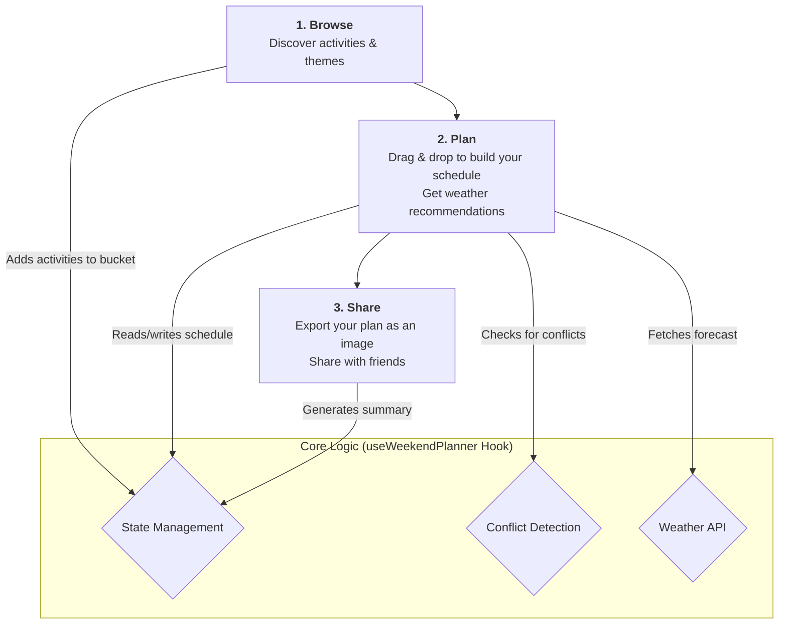

# Weekendly-Atlan: Your Smart Weekend Planner

Weekendly-Atlan is a dynamic web application designed to help you effortlessly plan and organize your perfect weekend. Browse activities, create a custom schedule, get smart weather-based recommendations, and share your itinerary with friends.

## Live Demo  
[Weekendly App](https://weekendly-atlan.vercel.app/)

## ✨ Key Features

| Feature                      | Description                                                                                                                                |
| :--------------------------- | :----------------------------------------------------------------------------------------------------------------------------------------- |
| **Browse & Discover**        | Explore a rich library of pre-defined activities and themes (e.g., "Lazy Weekend," "Adventure Time") to kickstart your planning.           |
| **Drag & Drop Scheduling**   | Intuitively arrange your chosen activities on a visual calendar for Saturday and Sunday.                                                   |
| **Smart Conflict Detection** | The app automatically prevents you from scheduling two activities at the same time, ensuring a conflict-free plan.                         |
| **Weather Integration**      | Get real-time weather forecasts for your location. The app provides warnings and suggests indoor alternatives for rainy days.              |
| **One-Click Swaps**          | Accept smart recommendations to swap outdoor plans for indoor ones with a single click when bad weather is detected.                       |
| **Share & Export**           | Download your final weekend plan as a PNG image or share it directly with friends and family through your device's native sharing options. |
| **Customizable Weekend**     | Choose between a standard two-day weekend or extend your plans to include more days.                                                       |

## 🚀 User Flow

The application guides you through a simple, three-step planning process:



## 🛠️ Technology Stack

- **Frontend:** [React](https://reactjs.org/)
- **Styling:** [Tailwind CSS](https://tailwindcss.com/)
- **Icons:** [Lucide React](https://lucide.dev/)
- **Image Export:** [html-to-image](https://github.com/bubkoo/html-to-image)
- **Notifications:** [React Hot Toast](https://react-hot-toast.com/)

## ⚙️ Getting Started

To get a local copy up and running, follow these simple steps.

### Prerequisites

- Node.js (v14 or later)
- npm

### Installation

1.  **Clone the repository:**
    ```sh
    git clone https://github.com/HiRoaR2002/Weekendly-Atlan.git
    ```
2.  **Navigate to the project directory:**
    ```sh
    cd Weekendly-Atlan
    ```
3.  **Install NPM packages:**
    ```sh
    npm install
    ```
4.  **Run the development server:**
    ```sh
    npm start
    ```
    The application will be available at `http://localhost:3000`.

## 🧠 Core Concepts

The application's logic is built around a few key concepts that work together to provide a seamless experience.

### 1. Activity & Theme Definitions (`src/constants.js`)

All available activities and themes are statically defined in `src/constants.js`.

- **Activities:** Individual items with properties like `id`, `name`, `duration`, `vibe`, and `icon`. They are grouped into categories (e.g., "Food & Drinks," "Outdoor Adventures").
- **Themes:** Pre-packaged collections of activity IDs that create a specific weekend experience (e.g., "Lazy Weekend").

### 2. Centralized State Management (`src/hooks/useWeekendPlanner.js`)

A single powerful React hook, `useWeekendPlanner`, acts as the "brain" of the application. It manages:

- The user's current view (`browse`, `plan`, `share`).
- The list of activities in the temporary `activityBucket`.
- The final `scheduledActivities` for each day.
- Weather data and smart recommendations.
- All business logic, including drag-and-drop handling and conflict detection.

### 3. Application Views (`src/components/views/`)

The user journey is split into three main views:

- **`BrowseView`:** Displays all themes and activities from `constants.js`, allowing users to add them to the `ActivityBucket`.
- **`PlanView`:** The main scheduling interface where users arrange activities on a timeline, see weather forecasts, and adjust their plans.
- **`ShareView`:** Presents a final, beautifully formatted summary of the plan, ready to be exported or shared.

---

